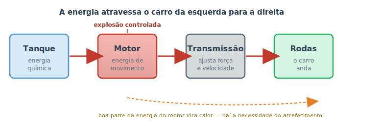

# Visão geral: como um carro funciona {#sec-visao-geral}

Antes de abrir o capô e mergulhar em cada peça, vale a pena olhar o carro de longe e entender a ideia geral. Um automóvel parece complicado — e é —, mas no fundo ele resolve um único problema: **pegar a energia guardada no combustível e transformá-la em movimento das rodas, com segurança e controle.** Tudo o que existe embaixo da lataria serve, de um jeito ou de outro, a esse objetivo.

Este capítulo é o mapa do manual. Aqui você vai conhecer os grandes sistemas do veículo, ver como a energia "viaja" do tanque até o asfalto e entender por que estudamos os assuntos na ordem em que eles aparecem. Não se preocupe em decorar nada: a ideia é só ganhar uma visão de conjunto para que os próximos capítulos encaixem como peças de um quebra-cabeça.

## A grande ideia: do combustível ao movimento

Pense no carro como uma linha de produção. Em uma ponta entra combustível; na outra ponta sai movimento. No meio, várias estações vão transformando uma coisa na outra, etapa por etapa, como mostra a @fig-fluxo-energia.

{#fig-fluxo-energia}

1. **Tanque:** guarda o combustível, que é energia *química* — a mesma ideia da comida que nos dá energia, só que para a máquina.
2. **Motor:** queima esse combustível em pequenas explosões e converte a energia química em energia de *movimento* (giro). É o assunto do @sec-motor.
3. **Transmissão:** ajusta esse giro — ora privilegiando força (para arrancar ou subir ladeira), ora velocidade (para cruzar a estrada). Veremos no @sec-transmissao.
4. **Rodas:** recebem o giro ajustado e empurram o carro contra o chão. O carro anda.

::: {.dica}
**Energia não some, ela se transforma.** Repare na seta laranja da figura: boa parte da energia do combustível não vira movimento — vira **calor**. Um motor comum aproveita só cerca de um terço da energia do combustível; o resto esquenta tudo ao redor. É exatamente por isso que o carro precisa de um sistema de arrefecimento para não derreter. Guarde essa ideia: muita coisa no carro existe para lidar com o calor que sobra.
:::

## Os grandes sistemas

Para cumprir essa missão, o carro se organiza em alguns sistemas. Cada um tem um papel, e cada um ganha um capítulo próprio mais adiante. Pense neles como os "órgãos" do veículo:

- **Motor** — o coração. Gera a força a partir do combustível.
- **Arrefecimento e lubrificação** — o "sangue" do motor. Um controla a temperatura; o outro reduz o atrito entre as peças que se esfregam.
- **Alimentação (combustível)** — o sistema digestivo. Leva combustível e ar ao motor na medida certa.
- **Transmissão** — o sistema que "traduz" a força do motor para as rodas, com a marcha adequada a cada situação.
- **Freios, suspensão e direção** — o que mantém o carro seguro e obediente: parar, absorver buracos e ir para onde o volante aponta.
- **Sistema elétrico** — a rede de energia e de "nervos". Dá a partida, gera a faísca, alimenta luzes, sensores e o computador de bordo.

A @fig-mapa-sistemas mostra como esses sistemas se relacionam. O motor fica no centro porque quase todos os outros existem para servi-lo ou para aproveitar a força que ele produz.

```{mermaid}
%%| label: fig-mapa-sistemas
%%| fig-cap: "Mapa dos sistemas do carro e como se conectam ao redor do motor."
graph TD
    M[("Motor")]
    F[Alimentação<br/>combustível e ar] --> M
    A[Arrefecimento<br/>e lubrificação] --- M
    E[Sistema elétrico] --> M
    M --> T[Transmissão]
    T --> R((Rodas))
    R --- B[Freios, suspensão<br/>e direção]
    E -.alimenta.-> L[Luzes, sensores<br/>e computador]

    classDef motor fill:#f5b7b1,stroke:#c0392b,stroke-width:2px;
    classDef apoio fill:#d6eaf8,stroke:#5499c7;
    classDef saida fill:#d5f5e3,stroke:#27ae60;
    class M motor;
    class F,A,E,L apoio;
    class T,R,B saida;
```

Note que nenhum sistema trabalha sozinho. Um filtro de ar sujo (alimentação) faz o motor perder potência; uma bateria fraca (elétrico) impede a partida; um pneu murcho (parte da "direção e segurança") aumenta o consumo. Entender essa teia de dependências é metade do caminho para diagnosticar problemas — assunto da Parte II deste manual.

## Combustão, híbrido ou elétrico: o que muda

A descrição acima vale para o carro mais comum hoje: o de **motor a combustão**, que queima gasolina, etanol ou diesel. Mas você já deve ter ouvido falar de carros híbridos e elétricos. A boa notícia é que a maior parte deste manual continua valendo para todos eles — afinal, todo carro tem rodas, freios, suspensão, direção e pneus.

- **Combustão:** a energia vem só do combustível queimado no motor. É o foco deste manual.
- **Híbrido:** combina um motor a combustão com um motor elétrico e uma bateria maior. Em baixas velocidades pode andar só no elétrico; em estrada, usa o motor a combustão. Tem os dois mundos — e a manutenção dos dois.
- **Elétrico (EV):** não tem motor a combustão, tanque, óleo de motor nem escapamento. A energia fica numa bateria grande e vai direto para motores elétricos nas rodas. Some boa parte da Parte I (motor, combustível, arrefecimento de motor), mas freios, suspensão, direção e pneus seguem iguais.

::: {.atencao}
Carros elétricos e híbridos trabalham com **alta tensão** (centenas de volts), suficiente para causar choque fatal. Os cabos e conectores de alta tensão costumam ser **alaranjados**. Nunca mexa neles em casa: a manutenção desses sistemas é exclusiva de profissionais treinados. As tarefas práticas da Parte III deste manual foram pensadas para carros a combustão.
:::

## Como este manual está organizado

Agora que você tem o mapa na cabeça, veja como vamos percorrê-lo:

- **Parte I — Fundamentos:** um capítulo por sistema, explicando *por que* cada um funciona. É a base teórica.
- **Parte II — Diagnóstico:** como usar os sentidos, as luzes do painel e o leitor de códigos (OBD-II) para descobrir o que está errado.
- **Parte III — Manutenção prática:** o passo a passo das tarefas que você mesmo pode fazer com segurança, terminando com um cronograma de "o que fazer e quando".

::: {.callout-tip}
## Não precisa ler tudo de uma vez
Se você é iniciante total, ler na ordem dá o melhor resultado, porque cada capítulo se apoia no anterior. Mas o manual também funciona como consulta: bateu uma dúvida sobre a luz que acendeu no painel? Pule para o @sec-luzes. O importante é começar.
:::

## Resumo

- O carro existe para transformar a energia química do combustível em movimento das rodas.
- Essa energia atravessa quatro estações principais: tanque → motor → transmissão → rodas.
- Boa parte da energia vira calor, e é por isso que existem os sistemas de arrefecimento e lubrificação.
- Os grandes sistemas (motor, alimentação, arrefecimento, transmissão, freios/suspensão/direção e elétrico) são interdependentes: a falha de um afeta os outros.
- Carros híbridos e elétricos mudam a fonte de energia, mas freios, suspensão, direção e pneus seguem valendo.
- O manual vai dos fundamentos ao diagnóstico e, por fim, à manutenção prática.
