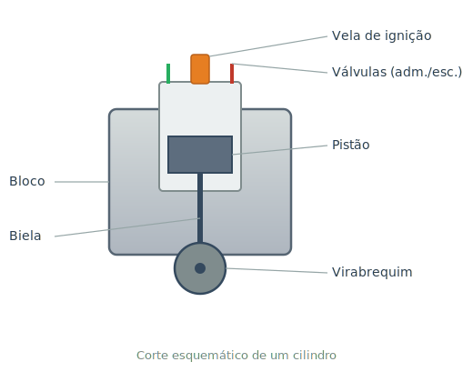
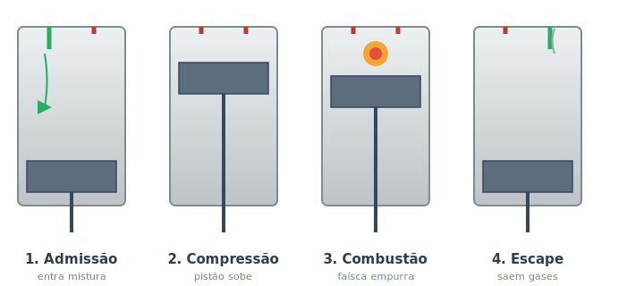

# O motor {#sec-motor}

O motor é o coração do carro: é onde a energia química do combustível vira movimento. Se você entender este capítulo, boa parte do resto do manual fará sentido naturalmente, porque quase todos os outros sistemas existem para *servir* o motor — alimentá-lo, resfriá-lo, lubrificá-lo ou transmitir a força que ele gera.

A grande maioria dos carros usa um **motor de combustão interna**: pequenas explosões controladas acontecem dentro dele, dezenas de vezes por segundo, e é isso que faz as rodas girarem. Vamos destrinchar como isso acontece.

## A ideia central: transformar explosão em rotação

Imagine empurrar um pistão para baixo dentro de um tubo. Se você conectar esse pistão a uma manivela, o movimento de *vai e vem* (para cima e para baixo) se transforma em movimento de *rotação*. É exatamente esse o truque do motor: a explosão do combustível empurra o pistão, e um conjunto de peças converte esse empurrão em giro.

{#fig-componentes}

As peças essenciais, mostradas na @fig-componentes, são:

- **Cilindro:** o tubo onde o pistão se move.
- **Pistão:** a peça que sobe e desce, empurrada pela explosão.
- **Biela:** a haste que liga o pistão ao virabrequim.
- **Virabrequim:** converte o movimento de sobe-e-desce em rotação. É a peça que, no fim da linha, gira as rodas.
- **Válvulas:** portas que abrem e fecham para deixar a mistura entrar e os gases saírem.
- **Vela de ignição:** produz a faísca que provoca a explosão (em motores a gasolina/etanol).

::: {.callout-note}
Carros a diesel não têm vela de ignição. Neles, o ar é comprimido com tanta força que esquenta o suficiente para inflamar o combustível sozinho. O princípio do sobe-e-desce, porém, é o mesmo.
:::

## O ciclo de quatro tempos

A maioria dos motores funciona em um ciclo de **quatro etapas**, repetidas continuamente. Por isso são chamados de motores "quatro tempos". Acompanhe na @fig-ciclo:

{#fig-ciclo}

1. **Admissão:** a válvula de admissão abre e o pistão desce, "puxando" para dentro do cilindro uma mistura de ar e combustível — como uma seringa enchendo.
2. **Compressão:** as válvulas fecham e o pistão sobe, comprimindo a mistura num espaço bem pequeno. Mistura comprimida explode com muito mais força.
3. **Combustão:** a vela solta uma faísca, a mistura explode e empurra o pistão violentamente para baixo. **Este é o único tempo que gera força** — os outros três são "preparação".
4. **Escape:** a válvula de escape abre e o pistão sobe de novo, expulsando os gases queimados para o escapamento.

E recomeça. Em marcha lenta, esse ciclo completo acontece cerca de 12 a 15 vezes por segundo em cada cilindro.

::: {.dica}
**Por que "1-3-4-2"?** A maioria dos motores tem 4 cilindros trabalhando em momentos diferentes do ciclo. Enquanto um faz a combustão (gerando força), outro está admitindo, outro comprimindo e outro escapando. Assim o motor entrega força de forma contínua e suave, sem "solavancos".
:::

## Por que isso importa para a manutenção

Entender o ciclo ajuda a interpretar sintomas. Alguns exemplos que você verá em detalhe na Parte II:

- **Motor "falhando" ou tremendo:** muitas vezes é uma vela ruim — a faísca da etapa de combustão não acontece direito em um dos cilindros.
- **Perda de potência:** pode ser compressão baixa (a etapa 2 não está vedando bem) ou filtro de ar sujo (a etapa 1 não consegue puxar ar suficiente).
- **Fumaça pelo escapamento:** o que sai na etapa 4 conta uma história — fumaça azul é óleo queimando, branca pode ser água, preta é excesso de combustível.

::: {.callout-tip}
## O motor não trabalha sozinho
Repare que o ciclo depende de combustível na hora certa (sistema de alimentação), faísca na hora certa (sistema elétrico), e tudo isso gera muito calor e atrito (daí os sistemas de arrefecimento e lubrificação). É por isso que os próximos capítulos tratam justamente desses sistemas de apoio.
:::

## Resumo

- O motor transforma a energia do combustível em rotação por meio de explosões controladas.
- O pistão sobe e desce; a biela e o virabrequim convertem esse movimento em giro.
- O ciclo de quatro tempos é: admissão, compressão, combustão e escape.
- Apenas a combustão gera força; as outras etapas preparam o ciclo.
- Quase todos os outros sistemas do carro existem para apoiar esse processo.
