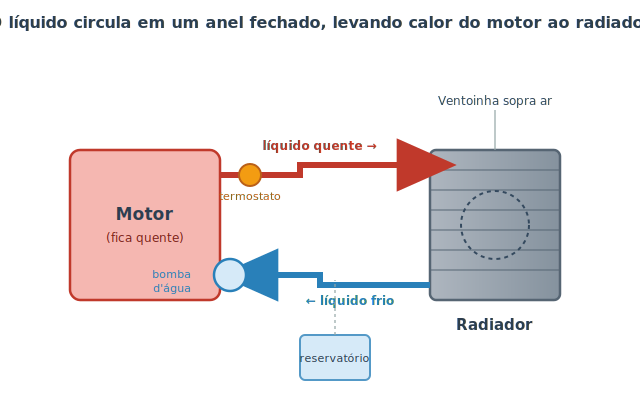
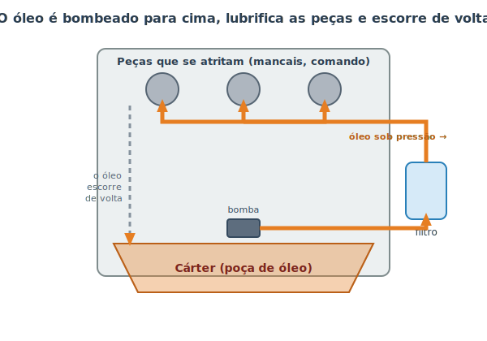

# Arrefecimento e lubrificação {#sec-arrefecimento}

No capítulo anterior vimos que o motor desperdiça boa parte da energia do combustível em forma de **calor**, e que suas peças vivem se esfregando uma na outra em alta velocidade. Dois problemas, portanto, ameaçam o motor o tempo todo: ele pode **superaquecer** e pode se **desgastar pelo atrito**. Os dois sistemas deste capítulo são a resposta para isso. O arrefecimento controla a temperatura; a lubrificação combate o atrito. São sistemas diferentes, mas trabalham lado a lado para manter o motor vivo — por isso os estudamos juntos.

Uma analogia ajuda: pense num corredor de maratona. Ele precisa **suar** para não superaquecer (isso é o arrefecimento) e precisa de **articulações bem lubrificadas** para não destruir os joelhos a cada passada (isso é a lubrificação). Falte um dos dois e a corrida acaba mal.

## Sistema de arrefecimento

O motor funciona melhor numa faixa de temperatura específica — em geral em torno de 90 °C. Frio demais, ele gasta mais combustível e se desgasta; quente demais, o metal dilata, o óleo perde a proteção e peças podem literalmente **fundir** (grudar umas nas outras). O arrefecimento existe para segurar o motor nessa faixa ideal.

A maioria dos carros usa arrefecimento **líquido**: um fluido circula por dentro do motor, absorve o calor e leva esse calor até um trocador de calor (o radiador), onde o ar o dissipa. É um anel fechado, como mostra a @fig-circuito-arrefecimento.

{#fig-circuito-arrefecimento}

Acompanhe o caminho do líquido:

- **Bomba d'água:** empurra o líquido pelo circuito. Costuma ser movida pelo próprio motor (por uma correia), então só circula com o motor funcionando.
- **Galerias do motor:** canais por dentro do bloco onde o líquido passa rente às partes quentes e "rouba" o calor delas.
- **Termostato:** uma válvula que se abre com o calor. Com o motor frio, ele fica **fechado**, segurando o líquido dentro do motor para ele aquecer rápido. Quando atinge a temperatura ideal, abre e libera o líquido para o radiador.
- **Radiador:** uma grade de tubos finos na frente do carro. O ar que passa entre eles (ajudado pela **ventoinha**, um ventilador elétrico) resfria o líquido.
- **Reservatório de expansão:** o líquido se expande quando esquenta. Esse potinho transparente dá espaço para a sobra e é por onde você confere o nível.

::: {.callout-note}
Esse líquido **não é água pura.** É uma mistura de água com **aditivo** (também chamado de "fluido de arrefecimento" ou, em inglês, *coolant*). O aditivo eleva o ponto de fervura, abaixa o de congelamento e protege o metal contra ferrugem. Completar só com água, na emergência, pode; manter sempre só com água, não — enferruja o sistema por dentro.
:::

### Quando o arrefecimento falha

O sintoma clássico é o **superaquecimento**: o ponteiro de temperatura sobe para a zona vermelha ou a luz de temperatura acende. Causas comuns: nível de líquido baixo (muitas vezes por um vazamento), termostato travado fechado, ventoinha que parou de funcionar ou correia da bomba rompida.

::: {.perigo}
**Nunca abra a tampa do radiador ou do reservatório com o motor quente.** O sistema é pressurizado e o líquido está acima de 100 °C. Abrir libera um jato de vapor e fluido fervente que causa queimaduras graves. Se o carro superaquecer, **pare, desligue e espere o motor esfriar** (30 minutos ou mais) antes de checar qualquer coisa.
:::

::: {.atencao}
Continuar dirigindo com o motor superaquecido é uma das formas mais rápidas e caras de destruir um motor: a junta do cabeçote queima, o cabeçote empena, e o conserto pode custar mais que o carro vale. Ao primeiro sinal, pare em local seguro.
:::

## Sistema de lubrificação

Dentro do motor, peças de metal deslizam e giram umas contra as outras milhares de vezes por minuto. Sem nada entre elas, o atrito as desgastaria em segundos e geraria calor suficiente para soldá-las. O **óleo** resolve isso criando uma película escorregadia que mantém as superfícies separadas — como uma fina camada de gel que impede que duas peças se toquem diretamente.

Mas o óleo faz mais do que "escorregar". Ele também:

- **Resfria** pontos internos onde o líquido de arrefecimento não chega.
- **Limpa**, carregando partículas e resíduos até o filtro.
- **Veda** pequenas folgas entre o pistão e o cilindro, ajudando na compressão.
- **Protege** contra ferrugem.

Para fazer tudo isso, o óleo precisa estar em todos os cantos do motor o tempo todo. A @fig-circuito-oleo mostra como ele circula.

{#fig-circuito-oleo}

- **Cárter:** a "poça" no fundo do motor onde o óleo se acumula em repouso. É de onde a vareta mede o nível.
- **Bomba de óleo:** puxa o óleo do cárter e o manda sob pressão para o resto do motor.
- **Filtro de óleo:** retém as sujeiras que o óleo recolheu. Por isso ele é trocado **junto** com o óleo.
- **Galerias:** canais que levam o óleo pressurizado até os mancais do virabrequim, o comando de válvulas e as paredes dos cilindros.
- **Retorno:** depois de lubrificar, o óleo simplesmente escorre de volta para o cárter pela gravidade, e o ciclo recomeça.

### Por que o óleo "envelhece"

Com o uso, o óleo vai ficando saturado de fuligem e resíduos da queima, perde os aditivos que o protegem e literalmente fica mais "fraco" — escurece e perde a capacidade de lubrificar bem. Por isso ele tem prazo de validade em **quilômetros rodados** e em **tempo**. Trocar o óleo na hora certa é, de longe, a manutenção que mais prolonga a vida de um motor (o passo a passo está no @sec-troca-oleo).

::: {.dica}
**O que significam os números do óleo (ex.: 5W-30)?** É a viscosidade — o quão "grosso" o óleo é. O número antes do **W** (de *winter*, inverno) indica o comportamento a frio: quanto menor, mais fino quando o motor está frio, melhor para a partida. O número depois indica o comportamento quente. **Use sempre a especificação que o fabricante do carro recomenda** no manual do veículo; óleo errado lubrifica mal.
:::

::: {.atencao}
Óleo e líquido de arrefecimento são fluidos **diferentes**, com reservatórios diferentes. Confundi-los ou completar um no lugar do outro causa danos sérios. Na dúvida, confira a tampa: ela costuma trazer o símbolo ou o nome do fluido correto.
:::

## Resumo

- O motor precisa ser mantido morno (nem frio, nem quente demais) e protegido do atrito; daí os dois sistemas deste capítulo.
- O arrefecimento é um anel fechado: bomba → motor → termostato → radiador → e de volta, com a ventoinha ajudando a esfriar.
- O termostato segura o líquido até o motor aquecer; o reservatório acomoda a expansão e indica o nível.
- Nunca abra o sistema de arrefecimento quente: ele é pressurizado e escalda.
- O óleo separa as peças metálicas, além de resfriar, limpar, vedar e proteger; ele circula do cárter, pela bomba e pelo filtro, até as peças.
- O óleo envelhece e deve ser trocado (com o filtro) na quilometragem e no tempo indicados pelo fabricante.
