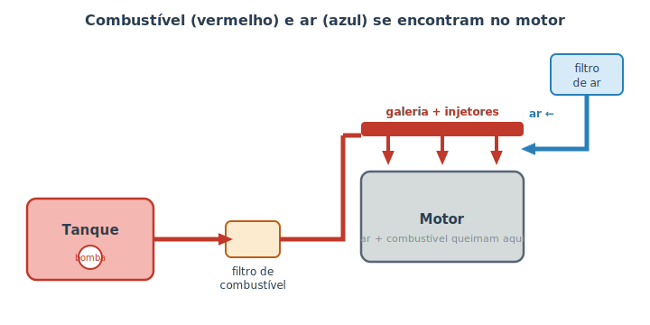

# Sistema de combustível {#sec-combustivel}

Vimos no @sec-motor que o motor funciona queimando uma mistura de **ar e combustível**. Mas essa mistura não pode ser qualquer uma: se sobra combustível, o motor "afoga", gasta demais e polui; se falta, ele perde força e "engasga". O sistema de combustível é o responsável por entregar o combustível ao motor na **quantidade certa, na hora certa e bem limpo**. Pense nele como o sistema digestivo do carro: ele pega o "alimento" guardado e o serve ao motor na medida exata.

Hoje praticamente todos os carros fazem isso por **injeção eletrônica**, comandada por um pequeno computador. Mas antes da eletrônica, vamos seguir o caminho físico do combustível.

## Do tanque ao motor

A @fig-percurso-combustivel mostra a jornada do combustível, do tanque até o ponto em que ele encontra o ar e entra no motor.

{#fig-percurso-combustivel}

- **Tanque:** o reservatório, normalmente na traseira do carro.
- **Bomba de combustível:** quase sempre fica **dentro** do tanque, submersa no próprio combustível (que a resfria). É ela que pressuriza a linha e empurra o combustível para a frente. É também a razão de o carro fazer um leve zumbido por um segundo quando você liga a chave: a bomba está pressurizando o sistema.
- **Filtro de combustível:** retém impurezas e água que possam estar no combustível, protegendo os injetores, que têm furos finíssimos.
- **Galeria e injetores:** a galeria distribui o combustível pressurizado aos **injetores** — pequenas válvulas eletrônicas que pulverizam o combustível em forma de névoa fina, parecido com um borrifador de perfume. Névoa fina queima muito melhor que um jato grosso.

Em paralelo, o **ar** entra por outro caminho: passa pelo **filtro de ar** (que segura poeira e insetos) e segue para o coletor de admissão, onde se encontra com o combustível pulverizado. É essa mistura que o pistão aspira na etapa de admissão.

::: {.dica}
**Por que o filtro de ar importa tanto?** O motor "respira" muito ar — bem mais do que parece. Um filtro de ar entupido sufoca o motor, igual a tentar correr respirando por um canudo: sobra combustível, falta ar, e o resultado é perda de potência e aumento de consumo. Trocar o filtro de ar é barato e um dos cuidados de melhor custo-benefício (veja o @sec-fluidos).
:::

## O cérebro: injeção eletrônica

Antigamente, um dispositivo mecânico chamado **carburador** misturava ar e combustível "no chute", com base na sucção do motor. Funcionava, mas era impreciso. Hoje, um computador chamado **central eletrônica** (ou ECU, na sigla em inglês) controla tudo.

A central lê vários sensores — quanto de ar está entrando, a temperatura, a posição do acelerador, o quanto de oxigênio sobra no escapamento (a **sonda lambda**) — e calcula, muitas vezes por segundo, exatamente quanto combustível cada injetor deve liberar. É como um cozinheiro experiente provando o prato e ajustando o tempero o tempo todo, em vez de despejar uma quantidade fixa.

Esse ajuste fino é o que permite aos carros modernos serem ao mesmo tempo econômicos e menos poluentes. E é também o que torna o sistema **autodiagnosticável**: como há sensores e um computador, o carro percebe quando algo sai do esperado e registra um código de falha — assunto do @sec-obd2.

## Flex: gasolina, etanol ou os dois

No Brasil, a maioria dos carros é **flex** (*flexible fuel*): roda com gasolina, com etanol ou com qualquer mistura dos dois no mesmo tanque. Isso é possível porque a central eletrônica **detecta** qual combustível está sendo usado (pela leitura da queima) e ajusta a injeção e o ponto de ignição automaticamente.

Os dois combustíveis têm características diferentes:

- O **etanol** rende menos por litro (você anda menos km com a mesma quantidade), mas costuma ser mais barato e tem queima mais "limpa".
- A **gasolina** rende mais por litro e facilita a partida a frio.

::: {.callout-note}
É por causa da partida a frio que muitos carros flex têm um **pequeno reservatório auxiliar de gasolina**: em dias frios, o etanol puro tem dificuldade de inflamar, então o carro usa um pouquinho de gasolina só para "pegar". Em modelos mais novos, sistemas de aquecimento dispensam esse reservatório.
:::

::: {.atencao}
**Diesel é outra história.** Carros a diesel não têm vela de ignição e usam bombas e injetores de altíssima pressão. Nunca abasteça um carro a gasolina/etanol com diesel, nem o contrário: o combustível errado pode danificar a bomba e os injetores e exigir a limpeza completa do sistema. Se errar no posto, **não ligue o motor** e chame um guincho.
:::

## Sinais de problema no sistema de combustível

Como esse sistema alimenta o motor, suas falhas aparecem como problemas de funcionamento:

- **Motor engasga ou "morre" em baixa rotação:** pode ser filtro de combustível entupido ou bomba enfraquecendo.
- **Demora para dar partida e perda de força:** pressão de combustível baixa, bomba ou filtro.
- **Consumo subiu sem explicação:** filtro de ar sujo, injetor sujo ou sensor de oxigênio com defeito.
- **Cheiro forte de combustível:** possível vazamento — leve a sério (veja o @sec-ouvindo).

::: {.dica}
Combustível de **má qualidade ou adulterado** é uma causa frequente de problemas que parecem mecânicos. Abastecer em postos de confiança e manter o filtro de combustível em dia previne muita dor de cabeça.
:::

## Resumo

- O sistema de combustível entrega combustível ao motor na quantidade certa, na hora certa e filtrado.
- O caminho é: tanque → bomba (dentro do tanque) → filtro → injetores, que pulverizam o combustível para misturá-lo ao ar.
- O ar entra em paralelo pelo filtro de ar; um filtro entupido sufoca o motor.
- A injeção eletrônica é comandada por um computador (central/ECU) que ajusta a mistura lendo sensores, deixando o carro econômico e menos poluente.
- Carros flex detectam o combustível e se ajustam sozinhos; diesel é um sistema à parte e não admite troca de combustível.
- Falhas de alimentação aparecem como engasgos, perda de força, partida difícil ou consumo elevado.
