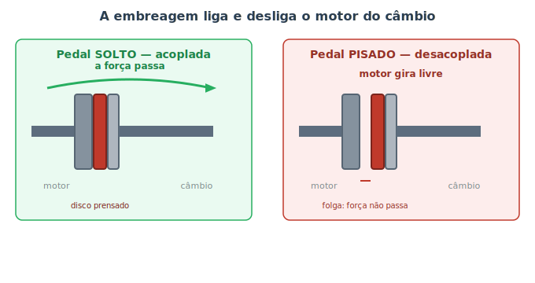
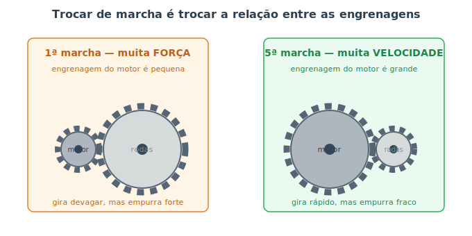

# Transmissão e embreagem {#sec-transmissao}

O motor que estudamos no @sec-motor tem uma limitação curiosa: ele só funciona bem dentro de uma faixa de rotação — nem muito devagar, nem muito rápido. Mas o carro precisa fazer coisas muito diferentes: arrancar do zero, subir uma ladeira íngreme, cruzar a estrada a 100 km/h. Como um único motor dá conta de tudo isso? A resposta é a **transmissão**: um conjunto de engrenagens que "traduz" a rotação do motor para o que as rodas precisam em cada momento.

E há um segundo problema. O motor nunca para de girar enquanto está ligado, mas o carro precisa ficar parado no sinal sem morrer. Algo tem que **desconectar** temporariamente o motor das rodas. Esse algo é a **embreagem** (no câmbio manual). Vamos começar por ela.

## A embreagem: ligar e desligar o motor das rodas

Imagine dois pratos girando: um é o motor (sempre girando), o outro leva às rodas. A embreagem é o que decide se esses dois pratos estão **grudados** (a força passa) ou **separados** (cada um livre). A @fig-embreagem mostra os dois estados.

{#fig-embreagem}

- **Pedal solto (acoplada):** uma mola forte prensa o **disco de embreagem** contra o **volante** do motor. Grudados pelo atrito, eles giram juntos e a força segue para o câmbio.
- **Pedal pisado (desacoplada):** você afasta o disco do volante. Abre-se uma folga, o atrito some e o motor passa a girar "no vazio", sem empurrar as rodas.

É por isso que, no carro manual, você **pisa na embreagem** para trocar de marcha (desconectar, mexer nas engrenagens, reconectar) e para parar no sinal sem desligar o motor.

::: {.dica}
**Por que a embreagem "queima"?** Ao arrancar, você solta o pedal devagar e, por um instante, o disco e o volante deslizam um contra o outro até "casarem" a velocidade — esse atrito gera calor e desgaste normais. Mas dirigir com o pé apoiado no pedal (o famoso "descansar o pé na embreagem") mantém esse deslizamento o tempo todo e **queima** o disco precocemente. Tire o pé do pedal quando não estiver usando.
:::

## As marchas: trocar força por velocidade

Aqui entra a sacada central da transmissão. Quando duas engrenagens de tamanhos diferentes se engrenam, elas trocam **força por velocidade**, como mostra a @fig-conjunto-marchas.

{#fig-conjunto-marchas}

- **Marcha reduzida (1ª):** uma engrenagem **pequena** do motor gira uma **grande** ligada às rodas. As rodas giram devagar, mas com muita força — perfeito para tirar o carro da inércia ou subir ladeira. É como usar uma marcha leve na bicicleta para subir o morro: você pedala muito, mas sobe.
- **Marcha alta (5ª/6ª):** agora a engrenagem do motor é **maior** que a das rodas. As rodas giram rápido, mas com pouca força — ideal para manter velocidade na estrada gastando pouco combustível. É a marcha "pesada" da bicicleta no plano.

Trocar de marcha é, no fundo, escolher qual par de engrenagens vai ficar conectado. As marchas baixas privilegiam força; as altas, velocidade. A **marcha à ré** usa uma engrenagem extra no meio, que faz tudo girar para o outro lado.

::: {.callout-note}
Depois das marchas, a força ainda passa pelo **diferencial**, um conjunto de engrenagens junto às rodas motrizes. Ele permite que, numa curva, a roda de fora gire mais que a de dentro (afinal, ela percorre um caminho mais longo). Sem o diferencial, as rodas "brigariam" entre si nas curvas.
:::

## Manual, automático, CVT e automatizado

Existem várias formas de fazer essa troca de relações acontecer:

- **Câmbio manual:** você opera a embreagem (pedal) e escolhe a marcha (alavanca). Dá mais controle e costuma ser mais barato de manter, mas exige prática.
- **Câmbio automático tradicional:** troca as marchas sozinho. No lugar da embreagem usa um **conversor de torque**, que acopla o motor por meio de fluido (sem pedal de embreagem). Mais confortável, principalmente no trânsito.
- **CVT (continuamente variável):** em vez de marchas fixas, usa um sistema de polias que muda de tamanho de forma contínua. Não há "trancos" de troca — a relação varia suavemente, como um botão de volume em vez de degraus.
- **Automatizado / dupla embreagem:** um câmbio mecânico (parecido com o manual por dentro) cujas trocas são feitas por motores e computador. Os de **dupla embreagem** trocam muito rápido, quase sem perda de força.

::: {.atencao}
Cada tipo de câmbio tem **fluido e manutenção próprios**. Câmbios automáticos, CVT e de dupla embreagem costumam pedir troca de óleo específico em intervalos definidos pelo fabricante — ignorar isso é uma das principais causas de defeitos caros nesses sistemas. Nunca complete o câmbio com um fluido qualquer; use exatamente o especificado.
:::

::: {.dica}
**Sintomas de transmissão para ficar de olho:** trocas com solavancos, "patinação" (o motor acelera mas o carro não ganha velocidade na mesma proporção — sinal clássico de embreagem gasta ou fluido baixo no automático), cheiro de queimado depois de ladeira e dificuldade para engatar marchas no manual. Veja mais no @sec-ouvindo.
:::

## Resumo

- O motor só rende numa faixa de rotação; a transmissão "traduz" essa rotação para o que as rodas precisam em cada momento.
- A embreagem (no manual) acopla e desacopla o motor das rodas, permitindo trocar marchas e parar sem desligar.
- Engrenagens de tamanhos diferentes trocam força por velocidade: marchas baixas dão força; marchas altas, velocidade.
- O diferencial deixa as rodas girarem em velocidades diferentes nas curvas.
- Há vários tipos de câmbio — manual, automático, CVT e automatizado/dupla embreagem —, cada um com conforto, custo e manutenção próprios.
- Cada câmbio exige o fluido específico do fabricante; trocá-lo na hora certa evita defeitos caros.
