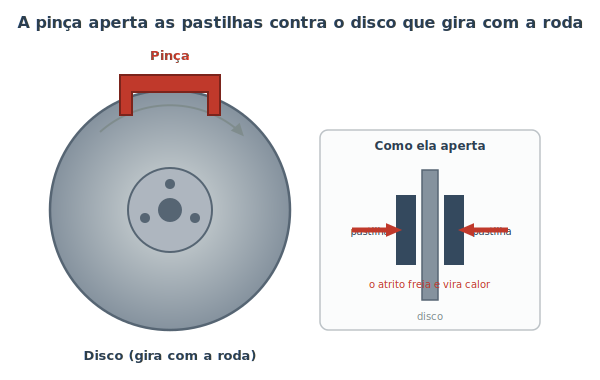
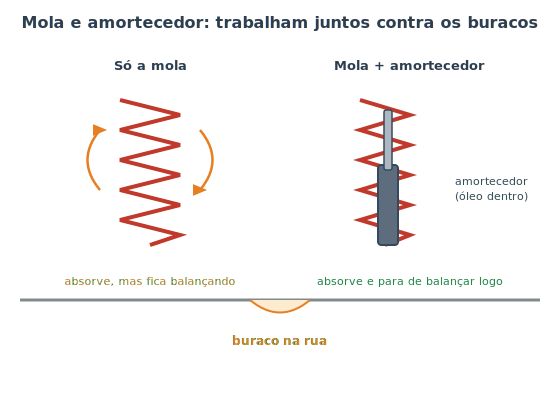

# Freios, suspensão e direção {#sec-freios-fund}

Até agora cuidamos de fazer o carro **andar**. Mas andar é a parte fácil — o difícil, e o que de fato salva vidas, é **parar**, **absorver o caminho** e **ir para onde você quer**. Estes são os três sistemas que mantêm o carro seguro e obediente. Eles não fazem o carro se mover, mas são, sem exagero, os mais importantes para a sua segurança. Por isso merecem atenção redobrada na manutenção (que veremos na Parte III).

## Freios: transformar movimento em calor

Pode parecer estranho, mas o freio não "segura" o carro: ele **transforma o movimento em calor**. A energia que o carro tem por estar em movimento precisa ir para algum lugar quando ele para — e vai para o calor gerado pelo atrito dos freios. É por isso que freios muito exigidos (descer uma serra longa, por exemplo) podem **esquentar** a ponto de perder eficiência.

O tipo mais comum é o **freio a disco**, mostrado na @fig-freio-disco.

{#fig-freio-disco}

- **Disco:** uma peça metálica que gira junto com a roda.
- **Pastilhas:** dois blocos de material resistente, um de cada lado do disco.
- **Pinça (caliper):** abraça o disco e, quando você pisa no freio, empurra as pastilhas contra ele. O atrito desacelera a roda.

Como isso acontece à distância, do pedal até a roda? Por um **fluido**. Ao pisar no pedal, você pressiona o fluido de freio, e essa pressão é transmitida pelas tubulações até as pinças nas quatro rodas. Líquidos quase não comprimem, então funcionam como uma "barra rígida" invisível que empurra as pastilhas. Alguns carros usam, atrás, o **freio a tambor** — mesmo princípio (atrito), mas com sapatas que se expandem contra um tambor.

::: {.callout-important}
## O fluido de freio é vital — e tem validade
O fluido de freio **absorve umidade** com o tempo. Água no fluido baixa seu ponto de fervura; em uma frenagem forte, o fluido pode ferver, formar bolhas de vapor (que *comprimem*) e o pedal "afunda" sem frear — uma falha perigosíssima. Por isso o fluido de freio deve ser trocado periodicamente (em geral a cada 2 anos), mesmo que pareça bom. Veja o @sec-freios-manut.
:::

::: {.dica}
**O que é o ABS?** É um sistema que impede as rodas de **travarem** numa freada brusca. Roda travada desliza (e quem desliza não esterça nem para bem). O ABS solta e reaplica o freio dezenas de vezes por segundo — daí a trepidação que você sente no pedal numa emergência. **Isso é normal:** mantenha o pé firme e continue esterçando para desviar.
:::

## Suspensão: conforto e, sobretudo, segurança

A suspensão liga as rodas ao corpo do carro e existe para duas coisas: deixar a viagem confortável e — o que muita gente não sabe — **manter os pneus colados no chão**. Um pneu que pula perde contato com o asfalto, e pneu sem contato não freia nem dirige. Suspensão, portanto, é item de segurança, não só de conforto.

Ela combina dois componentes que trabalham em dupla, como mostra a @fig-amortecedor-mola.

{#fig-amortecedor-mola}

- **Mola:** absorve o impacto do buraco, comprimindo e devolvendo. O problema é que, sozinha, ela continua **balançando** depois — como um pula-pula.
- **Amortecedor:** controla esse balanço. Por dentro, ele tem óleo que precisa passar por orifícios pequenos; isso oferece resistência e "freia" o sobe-e-desce, fazendo o pneu se assentar rapidamente.

::: {.atencao}
Amortecedor gasto não deixa o carro só "mais desconfortável" — ele aumenta a distância de frenagem e faz o carro "boiar" nas curvas, porque os pneus perdem contato com o solo. Sinais de desgaste: o carro continua balançando depois de um buraco, mergulha demais ao frear ou desgasta os pneus de forma irregular.
:::

## Direção: para onde o carro vai

A direção transforma o giro do volante no esterçamento das rodas dianteiras. O mecanismo básico converte o movimento circular do volante em movimento lateral que empurra as rodas para um lado ou para o outro.

Como esterçar rodas pesadas exigiria muita força, os carros usam **assistência**:

- **Direção hidráulica:** uma bomba movida pelo motor pressuriza um fluido que ajuda a "empurrar" as rodas. Tem o próprio reservatório de fluido para conferir.
- **Direção elétrica (EPS):** um motor elétrico faz a assistência. É a mais comum hoje, não usa fluido, pesa menos e gasta menos combustível.

::: {.callout-note}
**Alinhamento e balanceamento** são dois ajustes diferentes, sempre confundidos:

- **Alinhamento** acerta os *ângulos* das rodas. Se está errado, o carro "puxa" para um lado e os pneus se desgastam tortos.
- **Balanceamento** distribui o *peso* de cada roda com pequenos contrapesos. Se está errado, o volante **vibra** em certas velocidades.

Ambos devem ser verificados ao trocar pneus ou após uma pancada forte (um meio-fio, por exemplo). Veja o @sec-pneus.
:::

## Resumo

- Freios convertem o movimento do carro em calor pelo atrito; no freio a disco, a pinça aperta pastilhas contra o disco.
- A força do pedal chega às rodas por um fluido pressurizado; esse fluido absorve umidade e precisa ser trocado periodicamente.
- O ABS evita o travamento das rodas; a trepidação no pedal durante uma emergência é normal.
- A suspensão mantém os pneus no chão: a mola absorve o impacto e o amortecedor controla o balanço.
- Amortecedor gasto compromete a segurança, não só o conforto.
- A direção (hidráulica ou elétrica) facilita esterçar; alinhamento corrige ângulos e balanceamento corrige vibração.
