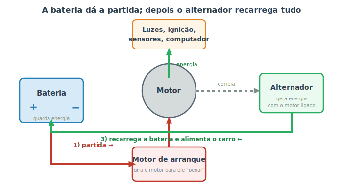

# Sistema elétrico e bateria {#sec-eletrico}

Se o motor é o coração do carro, o sistema elétrico é a sua **rede de energia e de nervos**. É ele que dá a partida, produz a faísca que acende a mistura, acende os faróis, move os vidros, alimenta os sensores e o computador de bordo. Um carro moderno tem dezenas de módulos eletrônicos conversando entre si — mas o coração elétrico continua sendo um trio simples: **bateria, motor de arranque e alternador**. Entender como esses três se revezam explica a maioria dos problemas de "o carro não liga".

## O trio fundamental

Há um problema de origem para resolver: o motor precisa estar girando para funcionar, mas para começar a girar é preciso energia. De onde vem essa primeira energia? Da bateria. E depois que o motor está girando, quem mantém tudo funcionando e recarrega a bateria? O alternador. A @fig-circuito-eletrico mostra esse revezamento.

{#fig-circuito-eletrico}

- **Bateria:** guarda energia química e a entrega como eletricidade. Sozinha, ela só dura para acionar a partida e manter coisas leves; **não** sustenta o carro por muito tempo com o motor desligado.
- **Motor de arranque:** um motor elétrico forte que, ao virar a chave (ou apertar o botão), recebe energia da bateria e **gira o motor de combustão** até ele "pegar". É o que faz o barulho característico de partida.
- **Alternador:** assim que o motor está funcionando, ele gira o alternador (por uma **correia**), que passa a **gerar eletricidade**. Essa energia recarrega a bateria e alimenta tudo: faróis, ar-condicionado, som, sensores, computador.

Em resumo: a bateria **empresta** a energia inicial, e o alternador **devolve** essa energia e sustenta o carro dali em diante. Por isso um alternador com defeito drena a bateria aos poucos — ela vai alimentando o carro sem ser recarregada, até acabar.

::: {.dica}
**Por que o carro "não pega" mas o de partida gira?** Se ao dar a partida você ouve o motor girar (o "rom-rom") mas ele não entra em funcionamento, o sistema elétrico de partida está **ok** — o problema costuma ser falta de combustível ou de faísca. Já se ao virar a chave você ouve só um **clique** ou nada, suspeite primeiro da bateria ou de suas conexões. Essa distinção é o primeiro passo do diagnóstico no @sec-diagnostico.
:::

## A faísca: do elétrico ao motor

Lembra do @sec-motor, onde a vela solta a faísca que provoca a explosão? Essa faísca é puro sistema elétrico. A bateria fornece apenas 12 volts, mas a vela precisa de **milhares de volts** para fazer a faísca saltar. Quem multiplica essa tensão é a **bobina de ignição**, e o computador decide o **momento exato** de cada faísca, sincronizado com a posição dos pistões.

Quando uma vela ou bobina falha, um cilindro deixa de queimar direito — o motor "treme", perde força e pode acender a luz de injeção. É um dos defeitos mais comuns e, felizmente, dos mais baratos de resolver (veja velas no @sec-fluidos).

## Fusíveis: os guardiões do circuito

Cada parte da rede elétrica é protegida por um **fusível**: uma pecinha barata com um fio fino que **queima de propósito** se passar corrente demais, interrompendo o circuito antes que o calor danifique a fiação ou cause incêndio. É um "elo fraco" proposital — sacrifica-se para salvar o resto.

Por isso, quando um item elétrico isolado para de funcionar (um vidro, o som, uma luz interna), o primeiro suspeito é um fusível queimado.

::: {.dica}
A caixa de fusíveis (geralmente uma perto do volante e outra no cofre do motor) tem uma **tampa com o mapa** de qual fusível protege o quê. Trocar um fusível é simples e seguro — desde que você use **um de mesma amperagem** (o número impresso nele). Nunca substitua por um de valor maior nem improvise com fio ou papel-alumínio: isso anula a proteção e pode causar incêndio.
:::

::: {.perigo}
A bateria contém **ácido** e seus polos podem soltar faíscas. Os gases que ela libera são **inflamáveis**. Ao mexer na bateria: nunca encoste uma ferramenta metálica nos dois polos ao mesmo tempo (curto-circuito), não aproxime chamas e use óculos de proteção. Para desconectar, solte **primeiro o polo negativo (−)**; para conectar, ligue o **negativo por último**. Isso reduz o risco de faísca. Veja mais em @sec-ferramentas.
:::

## Cuidados com a bateria

A bateria é a peça elétrica que mais dá trabalho, porque se desgasta com o tempo (em geral dura de 2 a 4 anos). Alguns cuidados simples:

- **Terminais limpos:** um pó esbranquiçado/esverdeado nos polos (sulfatação) atrapalha o contato e pode impedir a partida. Limpe com cuidado.
- **Carro parado por muito tempo descarrega a bateria**, porque o computador e o alarme consomem um pouquinho mesmo desligados. Dar uma volta de tempos em tempos ajuda a recarregar.
- **Luz da bateria no painel acesa com o motor ligado** indica que o alternador pode não estar carregando — não é "falta de bateria", é falha na recarga. Veja o @sec-luzes.

::: {.atencao}
Em carros **híbridos e elétricos** existe, além dessa bateria comum de 12 V, uma **bateria de alta tensão** (centenas de volts) com cabos geralmente **alaranjados**. Os cuidados deste capítulo valem para a bateria de 12 V; **jamais** mexa no sistema de alta tensão — ele é trabalho exclusivo de profissionais treinados.
:::

## Resumo

- O sistema elétrico dá a partida, gera a faísca e alimenta luzes, sensores e o computador do carro.
- A bateria empresta a energia inicial; o motor de arranque gira o motor; o alternador recarrega a bateria e sustenta o carro depois.
- Distinguir "de partida gira mas não pega" de "só dá um clique" já aponta o caminho do diagnóstico.
- A faísca da vela vem de 12 V multiplicados por uma bobina, no momento exato definido pelo computador.
- Fusíveis se queimam de propósito para proteger a fiação; troque sempre por um de mesma amperagem.
- A bateria contém ácido e gases inflamáveis: manuseie com cuidado e respeite a ordem dos polos.
