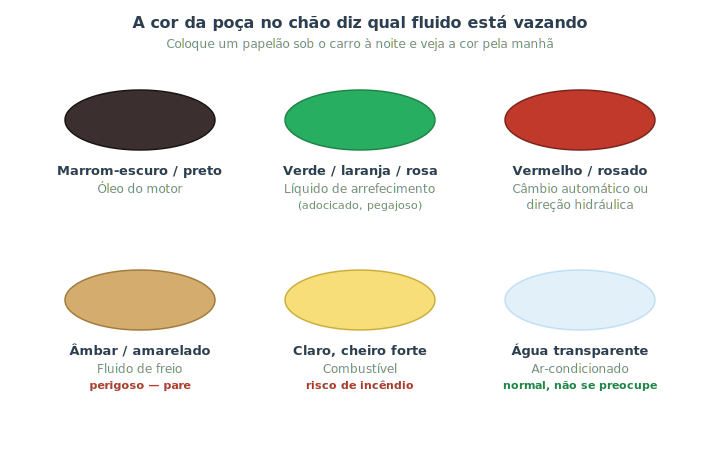

# Ouvindo o carro: ruídos, cheiros e vazamentos {#sec-ouvindo}

Começa aqui a Parte II, dedicada ao **diagnóstico** — descobrir o que está errado antes (ou em vez) de gastar com peças no escuro. E a melhor notícia para o iniciante é esta: você já tem, de fábrica, três instrumentos de diagnóstico excelentes — seus **ouvidos, seu nariz e seus olhos**. Muito mecânico experiente identifica um problema pelo som ou pelo cheiro antes de abrir qualquer coisa. Este capítulo ensina a "escutar" o que o carro está dizendo.

A ideia central é simples: **mudança é informação**. Um carro saudável tem um conjunto de sons, cheiros e aparência que é o seu "normal". Quando algo novo aparece — um ruído que não existia, um cheiro estranho, uma poça embaixo do carro —, é o veículo avisando que algo mudou. Quanto antes você perceber, mais barato e seguro é resolver.

## Ouvidos: o que cada ruído costuma indicar

Ruídos são pistas valiosas, principalmente porque muitas vezes mudam conforme a situação: ao frear, ao esterçar, ao acelerar, ao passar num buraco. Preste atenção a **quando** o som aparece — isso aponta o sistema responsável. A tabela a seguir reúne os ruídos mais comuns e suas causas prováveis.

| Ruído | Quando aparece | Causa provável |
|---|---|---|
| Chiado agudo (apito) | Ao frear | Pastilhas de freio gastas (o indicador de desgaste avisa) |
| Rangido metálico | Ao frear | Pastilha no fim — metal contra metal; **risco, veja já** |
| Clique ritmado | Em curvas, acelerando | Junta homocinética (semieixo) desgastada |
| Estalo seco | Ao passar em buracos | Suspensão: bandeja, batente ou amortecedor |
| Assobio agudo | Motor ligado, contínuo | Correia frouxa ou ressecada |
| Tilintar metálico fino | Acelerando, subindo ladeira | Detonação ("batida de pino") — combustível ou ponto |
| Ronco grave que aumenta com a velocidade | Andando | Rolamento de roda ou pneu desgastado |
| Tec-tec no ralenti | Motor frio, alivia ao esquentar | Folga de válvula ou óleo baixo/velho |
| Zumbido por 1–2 s ao ligar a chave | Antes da partida | Bomba de combustível pressurizando — **normal** |

::: {.dica}
**Localize o som como um detetive.** Ele muda com a **velocidade das rodas** (some quando você tira o pé e deixa rolar) ou com a **rotação do motor** (muda quando você acelera parado)? Isso já separa problemas de roda/freio/pneu de problemas de motor/correia. Aparece só ao **virar** o volante? Provável direção/semieixo. Só ao **frear**? Freios. Essa lógica do "quando" vale ouro no @sec-diagnostico.
:::

::: {.atencao}
Som metálico de **metal raspando metal ao frear** não é para deixar para depois: significa que a pastilha acabou e o suporte está riscando o disco. Além do risco de frenagem, o conserto fica muito mais caro (troca o disco junto). Veja @sec-freios-manut.
:::

## Nariz: cheiros e o que denunciam

O olfato detecta problemas que ainda não fazem barulho. Os principais:

- **Doce/adocicado (xarope):** líquido de arrefecimento vazando e evaporando no motor quente. Cheire isso junto com vapor saindo do capô e pense em superaquecimento (@sec-arrefecimento).
- **Queimado, tipo borracha/papel quente:** embreagem ou correia patinando, ou freio preso/superaquecido.
- **Óleo queimado:** óleo do motor vazando sobre peças quentes — além do cheiro, costuma haver fumaça azulada.
- **Ovo podre (enxofre):** problema na queima/catalisador. Vale uma verificação.
- **Combustível forte dentro ou perto do carro:** possível vazamento na linha de combustível. **Leve a sério**, é risco de incêndio.
- **Cheiro de "elétrico"/plástico queimado:** fiação superaquecendo ou curto. Desligue e investigue.

::: {.perigo}
Sentiu cheiro forte de **combustível** ou de **fiação/plástico queimando**? Pare em local seguro, desligue o motor e não tente "seguir mais um pouco". Vazamento de combustível e superaquecimento de fios são as duas principais causas de incêndio em veículos. Na dúvida, afaste-se do carro e peça ajuda.
:::

## Olhos: vazamentos e a cor que os entrega

Uma poça embaixo do carro assusta, mas a **cor** do fluido já diz muito sobre a gravidade e a origem, como mostra a @fig-cores-vazamento.

{#fig-cores-vazamento}

- **Marrom-escuro a preto:** óleo do motor. Pequenos vazamentos pioram com o tempo; fique de olho no nível.
- **Verde, laranja ou rosa, meio pegajoso e adocicado:** líquido de arrefecimento. Verifique o nível e procure a origem antes que superaqueça.
- **Vermelho ou rosado:** fluido de câmbio automático ou de direção hidráulica.
- **Âmbar/amarelado, oleoso:** pode ser fluido de freio — **trate como urgente**, pois afeta a frenagem.
- **Claro com cheiro forte:** combustível — risco de incêndio, veja o aviso acima.
- **Água transparente, sem cheiro:** quase sempre é só a **condensação do ar-condicionado** pingando. É **normal**, principalmente em dia quente e úmido.

::: {.dica}
**O truque do papelão.** Para saber se o carro está mesmo vazando (e de onde), estacione sobre uma folha de papelão limpo de um dia para o outro. De manhã, a posição e a cor da mancha revelam o fluido e a região do carro de onde ele cai. É diagnóstico de graça.
:::

## Resumo

- Seus sentidos são o primeiro e melhor kit de diagnóstico: mudança no som, cheiro ou aparência é o carro avisando.
- Para ruídos, o segredo é o **quando**: ao frear, ao esterçar, com a velocidade ou com a rotação — isso aponta o sistema.
- Cheiros denunciam o invisível: doce = arrefecimento; queimado = embreagem/correia/freio; combustível e fiação = pare e investigue.
- A cor do vazamento identifica o fluido; freio (âmbar) e combustível (claro, cheiroso) são os mais urgentes.
- Água transparente pingando costuma ser só o ar-condicionado — normal.
- O papelão sob o carro à noite é um truque simples para flagrar e localizar vazamentos.
