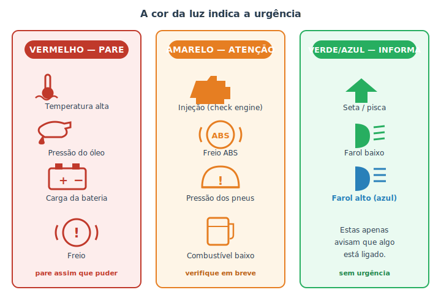

# Luzes do painel {#sec-luzes}

Quase todo mundo já sentiu aquele frio na barriga quando uma luz desconhecida acende no painel. A boa notícia é que essas luzes seguem um código de cores quase universal, pensado justamente para que **qualquer pessoa** entenda a urgência na hora — mesmo sem saber o que cada símbolo significa em detalhe. Se você aprender só uma coisa deste capítulo, que seja a regra das cores: **a cor diz o quanto corre.**

Vale também distinguir dois momentos. Quando você liga o carro, **várias luzes acendem juntas por alguns segundos** e depois apagam: isso é o autoteste do painel, é normal e até desejável (mostra que as lâmpadas funcionam). O que importa é a luz que **acende sozinha durante o uso** ou que **fica acesa** depois da partida.

## A regra das cores

A @fig-luzes-painel resume a lógica. Pense num semáforo: vermelho manda parar, amarelo manda ter atenção, verde libera.

{#fig-luzes-painel}

- **Vermelho — pare.** Indica um risco imediato ao carro ou a você. Pare assim que for seguro e investigue antes de seguir.
- **Amarelo (âmbar) — atenção.** Algo precisa de verificação, mas em geral dá para seguir com cuidado e resolver em breve.
- **Verde ou azul — informação.** Só avisam que um sistema está **ligado** (seta, farol). Não são defeito.

::: {.perigo}
Três luzes **vermelhas** pedem ação imediata — **pare o motor** assim que possível:

- **Temperatura/arrefecimento:** o motor está superaquecendo. Seguir dirigindo pode destruí-lo (veja @sec-arrefecimento).
- **Pressão do óleo (regador de óleo):** o motor pode estar sem lubrificação. Andar assim "trava" o motor em minutos. Pare e desligue.
- **Freio (círculo com "!"):** pode ser freio de mão puxado, fluido baixo ou falha no sistema de freios. Confirme o freio de mão; se persistir, **não confie nos freios**.
:::

## As luzes vermelhas em detalhe

- **Temperatura alta:** quase sempre símbolo de termômetro sobre ondas. Encoste, desligue e deixe esfriar. Não abra o radiador quente.
- **Pressão do óleo:** símbolo parecido com uma lamparina/regador pingando. **Não** significa "óleo para trocar"; significa pressão de óleo perigosamente baixa **agora**. Desligue o motor.
- **Carga da bateria:** símbolo de bateria. Acesa com o motor ligado, indica que o **alternador** pode não estar carregando (@sec-eletrico). O carro vai funcionando com a carga da bateria até ela acabar — procure ajuda antes disso.
- **Freio:** confira primeiro o freio de mão. Se apagou, era isso. Se continuar, trate como falha de freio.

## As luzes amarelas mais comuns

Amarelo é "resolva logo, sem pânico":

- **Injeção / check engine** (silhueta de um motor): a mais temida e a mais incompreendida. Acende para *qualquer* coisa que os sensores achem fora do esperado — de uma tampa de combustível mal fechada a uma vela falhando. **Acesa fixa**, dá para seguir e investigar em breve, de preferência lendo o código com um scanner (@sec-obd2). **Piscando**, indica falha de combustão acontecendo agora (pode danificar o catalisador) — reduza a velocidade e procure ajuda logo.
- **ABS:** o freio normal continua funcionando, mas o auxílio antitravamento pode estar desativado. Cuidado redobrado em piso molhado.
- **Pressão dos pneus (TPMS):** símbolo de pneu em corte com "!". Verifique a calibragem; pode ser só o frio ou o início de um furo (@sec-pneus).
- **Combustível baixo:** a reserva. Abasteça em breve; rodar com muito pouco combustível ainda força a bomba (que é resfriada pelo próprio combustível).

::: {.dica}
**Antes de pagar por um diagnóstico de "check engine", confira a tampa do tanque.** Uma tampa mal rosqueada é uma das causas mais comuns dessa luz, porque o sistema detecta a perda de pressão no tanque. Aperte bem a tampa; em alguns carros a luz apaga sozinha após algumas viagens.
:::

## Verdes e azuis: pode relaxar

Essas apenas confirmam que algo está ativo:

- **Verde:** setas, farol baixo, piloto automático ligado, etc.
- **Azul:** classicamente o **farol alto**. Se está aceso sem você querer, alguém vai reclamar do farol na cara — é só desligar o alto.

Não são avisos de defeito. Só fique atento a não esquecer, por exemplo, o farol alto ligado incomodando outros motoristas.

::: {.atencao}
Os símbolos variam um pouco entre marcas e modelos, e carros mais novos têm dezenas de luzes (assistentes de faixa, controle de tração, etc.). O **manual do proprietário** traz a lista completa do seu carro — vale a pena folhear a seção de luzes uma vez, com calma, para não ser pego de surpresa. Na dúvida sobre uma luz **vermelha**, o seguro é parar e verificar.
:::

## Resumo

- A cor da luz indica a urgência: vermelho = pare; amarelo = atenção; verde/azul = só informação.
- Luzes que acendem juntas por segundos na partida são o autoteste normal; preocupe-se com as que acendem ou ficam acesas durante o uso.
- Temperatura, pressão de óleo e freio em vermelho pedem parada imediata.
- "Check engine" acende por muitos motivos; fixa, investigue em breve; piscando, reduza e procure ajuda.
- Antes de gastar com diagnóstico de check engine, confira a tampa do tanque.
- Consulte o manual do proprietário para os símbolos específicos do seu carro.
