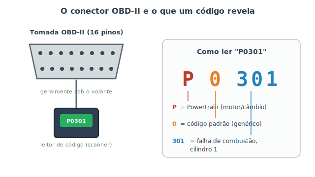

# Introdução ao OBD-II {#sec-obd2}

Nos capítulos anteriores você aprendeu a diagnosticar pelos sentidos e por árvores de decisão. Agora vamos a uma ajuda poderosa que vem de dentro do próprio carro. Lembra do computador de bordo do @sec-combustivel, que monitora dezenas de sensores? Quando ele detecta algo fora do esperado, não só acende a luz de injeção — ele **guarda um código** descrevendo o problema. O **OBD-II** é o sistema padronizado que permite a você ler esses códigos. É como pedir ao carro que aponte onde dói.

A sigla vem do inglês *On-Board Diagnostics, segunda geração*. "Segunda geração" porque é uma versão padronizada: desde meados dos anos 1990 (e obrigatório no Brasil para carros mais novos), praticamente todo carro usa o **mesmo conector** e os **mesmos códigos**, não importa a marca. Isso é ótimo para o iniciante: um leitor barato funciona em quase qualquer carro.

## O conector e o leitor (scanner)

Todo carro com OBD-II tem uma **tomada de 16 pinos** padronizada, quase sempre escondida embaixo do painel, perto do volante. Nela você conecta um **leitor de código** (scanner), como mostra a @fig-conector-obd2.

{#fig-conector-obd2}

Os leitores vêm em dois tipos, ambos acessíveis:

- **Leitor de mão:** um aparelhinho com tela própria. Você conecta, liga a ignição e ele mostra os códigos.
- **Adaptador Bluetooth/Wi-Fi (ELM327):** uma peça pequena que fica na tomada e conversa com um **aplicativo no celular**. É a opção mais barata e popular.

::: {.dica}
Para apenas **ler e apagar** códigos, um adaptador ELM327 de baixo custo com um aplicativo gratuito já resolve a maioria dos casos. Você não precisa do equipamento caro de oficina para dar o primeiro passo: saber *qual* é o código já tira você do escuro e evita "achismos" na hora de procurar ajuda.
:::

## Como ler um código

Os códigos seguem um formato padronizado de uma letra e quatro números, como o famoso **P0301**. Cada parte tem um significado, mostrado na @fig-conector-obd2 e detalhado abaixo:

- **A letra** indica o sistema:
  - **P** = *Powertrain* (motor e transmissão) — os mais comuns.
  - **B** = *Body* (carroceria: airbags, vidros, etc.).
  - **C** = *Chassis* (freios, ABS, direção).
  - **U** = *Network* (rede de comunicação entre os módulos).
- **O primeiro número** diz se o código é **0 (padrão/genérico**, igual em todos os carros) ou **1 (específico** do fabricante).
- **Os três últimos** apontam o subsistema e a falha exata.

Assim, **P0301** se lê como: **P** = motor, **0** = código padrão, **301** = falha de combustão (*misfire*) no **cilindro 1**. Repare que o último dígito (1) é o número do cilindro. Um **P0300** seria falha de combustão **aleatória/múltipla** (sem cilindro definido).

::: {.callout-note}
Alguns códigos genéricos úteis de conhecer:

- **P0300–P030X:** falhas de combustão (o X é o cilindro). Costuma ser vela, bobina ou injetor (@sec-eletrico).
- **P0420 / P0430:** eficiência do catalisador abaixo do esperado (pode ser sonda lambda ou o próprio catalisador).
- **P0171 / P0174:** mistura "pobre" demais (entrando mais ar que o previsto) — possível entrada de ar falsa ou sensor.
- **P0128:** motor não atinge a temperatura ideal — frequentemente um **termostato** travado aberto (@sec-arrefecimento).

Não decore: anote o código e pesquise. O valor está em chegar à oficina já sabendo do que se trata.
:::

## Apagar o código não conserta o problema

É tentador: o leitor permite **apagar** os códigos e a luz do painel se apaga. Mas isso não resolve nada — apenas limpa o aviso. Se a causa continua, o código volta a aparecer na próxima vez que a falha for detectada.

::: {.atencao}
Apagar códigos sem corrigir a causa pode até **mascarar** um problema sério e ainda atrapalhar quem for consertar depois (alguns dados de contexto se perdem). Use o "apagar" só **depois** de resolver o defeito, para confirmar que o código não retorna — aí sim é um bom teste de que o reparo funcionou. Em uma vistoria de inspeção, apagar pouco antes também não engana: o carro precisa rodar um tempo para reavaliar os sistemas, e a falta dessas reavaliações ("monitores não prontos") denuncia que os códigos foram zerados há pouco.
:::

## Os limites do diagnóstico caseiro

O OBD-II é uma janela maravilhosa, mas não é uma bola de cristal. Vale entender o que ele **não** faz:

- **O código aponta o sintoma, não a peça culpada.** "Falha no cilindro 1" não diz se é a vela, a bobina, o injetor ou a compressão. Ele estreita a busca; o raciocínio (e às vezes o teste de troca) faz o resto.
- **Nem todo problema gera código.** Ruídos de suspensão, vazamentos, pneus, freios mecânicos — boa parte do que vimos na Parte II **não** acende luz nenhuma. Por isso os sentidos continuam insubstituíveis (@sec-ouvindo).
- **Códigos específicos do fabricante (P1xxx)** podem exigir um aplicativo ou scanner mais completo para serem interpretados.

::: {.dica}
Combine as ferramentas: use os **sentidos** e as **árvores de decisão** (@sec-diagnostico) para entender o sintoma, o **OBD-II** para ler o que o carro registrou, e leve tudo isso ao profissional. Quem chega à oficina dizendo "está dando P0301 e o motor treme em marcha lenta" recebe um diagnóstico muito mais rápido — e mais barato — do que quem diz apenas "está estranho".
:::

## Resumo

- O OBD-II é o sistema padronizado que guarda **códigos de falha** detectados pelo computador do carro.
- A tomada de 16 pinos (perto do volante) recebe um leitor; um adaptador ELM327 barato com app de celular já basta para começar.
- Os códigos têm formato letra+números: a letra é o sistema (P = motor), o primeiro número diz se é padrão (0) ou do fabricante (1), e o resto detalha a falha.
- Exemplo: P0301 = falha de combustão no cilindro 1.
- Apagar o código não conserta nada; use o "apagar" só para confirmar o reparo.
- O OBD-II aponta o sintoma, não a peça culpada, e muitos problemas não geram código — combine-o com os sentidos e o raciocínio.
