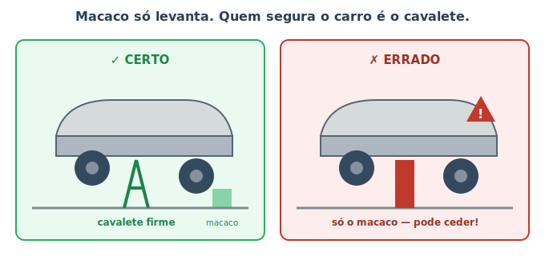
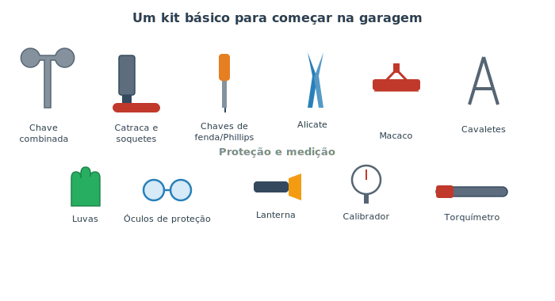

# Ferramentas e segurança na garagem {#sec-ferramentas}

Começa aqui a Parte III, a parte de "colocar a mão na graxa". Mas antes de qualquer chave de boca, precisamos falar de **segurança** — e não por formalidade. Um carro tem mais de uma tonelada, fluidos a mais de 100 °C, sistemas sob pressão, combustível inflamável e energia elétrica suficiente para machucar. A diferença entre um sábado produtivo na garagem e um acidente grave quase sempre está em alguns cuidados simples. **Leia este capítulo antes de executar qualquer tarefa das próximas páginas.**

::: {.perigo}
A regra mais importante de todo o manual: **nunca, jamais, coloque qualquer parte do corpo embaixo de um carro apoiado apenas no macaco.** O macaco serve para *levantar*; ele pode ceder, escorregar ou tombar. Quem *sustenta* o carro com segurança é o **cavalete**. Esta regra não tem exceção.
:::

## Macaco levanta, cavalete sustenta

Esta é a confusão que mais causa acidentes graves entre iniciantes, então vale uma figura inteira. A @fig-uso-cavalete mostra o certo e o errado.

{#fig-uso-cavalete}

O procedimento seguro é sempre:

1. Estacione em piso **plano e firme** (nunca na terra ou em ladeira), com o carro **desligado**, em marcha (ou em P) e com o **freio de mão** acionado.
2. **Calce as rodas** que ficarão no chão, na frente e atrás, com pedaços de madeira ou calços.
3. Levante o carro com o macaco no **ponto de apoio correto** (o manual do veículo indica esses pontos reforçados; apoiar no lugar errado entorta a lataria).
4. Encaixe os **cavaletes** sob pontos estruturais firmes e desça o carro lentamente até ele repousar sobre eles.
5. **Antes de entrar embaixo, balance o carro** com as mãos para confirmar que está firme.

::: {.atencao}
Use cavaletes **aos pares** e de capacidade adequada ao peso do carro (vem escrito neles). Se for trabalhar nas quatro rodas, são quatro cavaletes. E mantenha o macaco posicionado como **segurança extra**, mesmo com o carro já nos cavaletes — nunca como único apoio.
:::

## O kit básico de ferramentas

Você não precisa de uma oficina completa para começar. Um kit enxuto cobre a maioria das tarefas deste manual, como mostra a @fig-kit-ferramentas.

{#fig-kit-ferramentas}

- **Chaves combinadas e jogo de soquetes com catraca:** para soltar e apertar porcas e parafusos. A catraca agiliza muito.
- **Chaves de fenda e Phillips:** as duas pontas mais comuns de parafuso.
- **Alicate:** para segurar, dobrar e cortar.
- **Macaco e cavaletes:** já discutidos — itens de segurança, não de luxo.
- **Torquímetro:** aperta os parafusos no valor exato recomendado (o "torque"). Importante em rodas, velas e itens críticos — apertar "no sentimento" pode soltar ou espanar a rosca.
- **Calibrador de pneus e lanterna:** medição e visibilidade.
- **EPIs — equipamentos de proteção individual:** **luvas** (contra cortes, calor e produtos químicos) e **óculos de proteção** (fluidos e detritos pulam mais do que se imagina).

::: {.dica}
**Compre ferramenta conforme a necessidade.** Em vez de gastar muito num jogo gigante, comece com o básico e vá somando peças à medida que cada tarefa pedir. Ferramentas de qualidade razoável duram anos; as boas medidas (chaves no tamanho certo, em milímetros) evitam "espanar" parafusos.
:::

## Regras de segurança que valem para tudo

Independentemente da tarefa, estas regras se aplicam sempre:

- **Motor frio.** Espere o motor esfriar antes de mexer. Componentes e fluidos ficam quentes o bastante para causar queimaduras sérias, e o sistema de arrefecimento fica pressurizado (@sec-arrefecimento).
- **Desconecte a bateria** em qualquer trabalho elétrico (e em muitos mecânicos). Solte **primeiro o polo negativo (−)** para evitar curto e faísca (@sec-eletrico).
- **Ventilação.** Nunca deixe o motor ligado em local fechado: o escapamento contém **monóxido de carbono**, um gás invisível, inodoro e mortal. Vapores de combustível e solventes também pedem ambiente arejado.
- **Sem chamas nem cigarros** perto de combustível, bateria ou solventes.
- **Tire anéis, relógios e roupas largas**, e prenda cabelos compridos: tudo isso pode prender em peças girando ou causar curto.

::: {.perigo}
**Monóxido de carbono mata em silêncio.** Não dê partida nem deixe o motor funcionando em garagem fechada, nem "só por um minuto". Se precisar do motor ligado para um teste, faça em local aberto e ventilado. Os sintomas de envenenamento (dor de cabeça, tontura, sonolência) chegam quando já é tarde.
:::

## Descarte responsável dos fluidos

Óleo usado, líquido de arrefecimento e fluido de freio são **tóxicos** e não podem ir para o ralo, o lixo comum ou o solo — um litro de óleo contamina muita água. Guarde os fluidos usados em recipientes fechados (a própria embalagem do produto novo serve) e leve a um **ponto de coleta**: postos, lojas de autopeças e oficinas costumam receber óleo usado gratuitamente, pois ele é reciclado.

::: {.atencao}
O líquido de arrefecimento tem sabor adocicado e atrai **animais**, mas é altamente tóxico para eles. Limpe qualquer respingo imediatamente e nunca deixe recipientes abertos ao alcance de pets.
:::

## Resumo

- Segurança vem antes de qualquer tarefa: o macaco levanta, mas só o **cavalete** sustenta o carro — nunca trabalhe embaixo sem ele.
- Apoie o carro em piso plano, calce as rodas, use os pontos de apoio corretos e confirme a firmeza antes de entrar embaixo.
- Um kit básico (chaves, soquetes, alicate, torquímetro, macaco, cavaletes) e EPIs (luvas e óculos) já cobrem a maioria das tarefas.
- Regras universais: motor frio, bateria desconectada pelo negativo, boa ventilação, nada de chamas e sem acessórios soltos.
- Monóxido de carbono é mortal: jamais ligue o motor em local fechado.
- Descarte óleo e fluidos em pontos de coleta; nunca no ralo, no lixo ou no solo.
