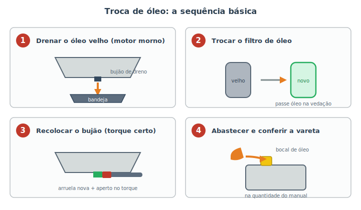

# Troca de óleo e filtros {#sec-troca-oleo}

A troca de óleo é a manutenção mais frequente e, provavelmente, a de maior impacto na vida do motor. Você já entendeu *por que* no @sec-arrefecimento: o óleo lubrifica, resfria, limpa e protege, mas envelhece e perde essas qualidades. Trocá-lo na hora certa é o melhor investimento que existe na conservação do carro. É também uma tarefa que muitos iniciantes conseguem fazer em casa — desde que respeitem a segurança da garagem (@sec-ferramentas).

::: {.atencao}
Antes de começar: confirme no **manual do veículo** três coisas — a **especificação do óleo** (ex.: 5W-30, com a norma exigida), a **quantidade** em litros e o **tipo de filtro**. Comprar errado é a falha mais comum. E lembre-se de que o motor deve estar **morno, não quente**: óleo morno escoa melhor; óleo fervendo queima a pele.
:::

## O que você vai precisar

- Óleo novo na especificação e quantidade corretas, e um **filtro de óleo** novo.
- **Bandeja de drenagem** com capacidade maior que o volume de óleo do motor.
- **Chave** para o bujão do cárter e **chave de filtro** (uma cinta que ajuda a soltar o filtro).
- **Arruela de vedação nova** para o bujão (muitos kits já incluem).
- Macaco, **cavaletes**, calços, luvas e óculos.
- Funil, panos e um recipiente fechado para levar o óleo usado ao ponto de coleta.

## O passo a passo

A @fig-troca-oleo-passos resume a sequência. Faça com o carro **bem apoiado nos cavaletes** (nunca só no macaco) e em piso plano.

{#fig-troca-oleo-passos}

1. **Drenar o óleo velho.** Posicione a bandeja sob o **bujão de dreno**, na parte mais baixa do cárter, e solte o bujão (cuidado: o óleo vai jorrar). Deixe escorrer até pingar devagar. Aproveite para **abrir a tampa do bocal** de óleo em cima — isso ajuda o óleo a descer mais rápido.
2. **Trocar o filtro.** Solte o filtro velho (ele ainda tem óleo dentro, então deixe a bandeja embaixo). Antes de instalar o novo, **passe um pouco de óleo limpo no anel de vedação** dele com o dedo — isso garante a vedação e facilita a próxima troca. Rosqueie o filtro novo **com a mão** até encostar e mais um aperto firme; não precisa de força bruta.
3. **Recolocar o bujão.** Com uma **arruela de vedação nova**, recoloque o bujão e aperte no **torque** recomendado. Apertar demais espana a rosca do cárter (um reparo caro); de menos, vaza.
4. **Abastecer e conferir.** Pelo bocal de cima, coloque o óleo novo com um funil, **um pouco abaixo** da quantidade total indicada. Espere um minuto, dê a partida por alguns segundos (a pressão de óleo estabiliza) e desligue. Espere o óleo assentar e **confira a vareta**: o nível deve ficar entre as marcas de mínimo e máximo. Complete aos poucos se faltar.

::: {.dica}
**Como ler a vareta corretamente:** puxe a vareta, limpe com um pano, recoloque até o fim, puxe de novo e leia. O óleo deve estar entre as marcas **MÍN** e **MÁX**. Faça isso com o carro no plano e o motor desligado há alguns minutos. Nível alto demais é tão ruim quanto baixo — pode espumar e danificar o motor.
:::

::: {.atencao}
Depois da troca, **dê a partida e procure vazamentos** sob o carro, especialmente ao redor do bujão e do filtro. Rode um pouco e **confira a vareta de novo** no dia seguinte. E não esqueça de **zerar o aviso de troca de óleo** do painel, se o seu carro tiver — mas só depois de realmente trocar (lembre-se: zerar o aviso não troca o óleo, do mesmo jeito que apagar um código não conserta a falha, como vimos no @sec-obd2).
:::

## De quanto em quanto tempo trocar

O intervalo varia conforme o carro e o tipo de óleo, mas há uma regra de ouro: **o que vier primeiro**, quilometragem **ou** tempo. Mesmo rodando pouco, o óleo envelhece pela umidade e pela oxidação, então um carro que anda pouco ainda precisa de troca por **tempo** (em geral a cada 12 meses). Siga sempre o manual do veículo; o @sec-cronograma traz uma tabela consolidada.

::: {.callout-note}
**Condições severas** encurtam o intervalo: trânsito intenso com muitas paradas, trajetos curtos (o motor não esquenta o bastante para evaporar a umidade do óleo), poeira, reboque de carga ou estradas de terra. Nesses casos, troque antes do prazo "normal".
:::

## O óleo usado: descarte certo

Reforçando o @sec-ferramentas: o óleo velho é **tóxico e reciclável**. Guarde-o num recipiente fechado (a embalagem do óleo novo serve) e leve a um ponto de coleta — postos, autopeças e oficinas costumam receber de graça. O mesmo vale para o **filtro usado**, que retém óleo. Nunca jogue no ralo, no lixo comum ou no chão.

## Resumo

- A troca de óleo é a manutenção de maior impacto na vida do motor; confirme óleo, quantidade e filtro no manual antes de começar.
- Faça com o motor morno e o carro firme sobre cavaletes.
- Sequência: drenar o óleo velho, trocar o filtro (com óleo na vedação), recolocar o bujão com arruela nova no torque certo e abastecer.
- Confira o nível pela vareta (entre mín e máx) e procure vazamentos depois.
- Troque pelo que vier primeiro, km ou tempo; condições severas encurtam o intervalo.
- Descarte óleo e filtro usados em pontos de coleta.
