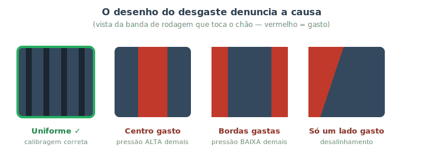
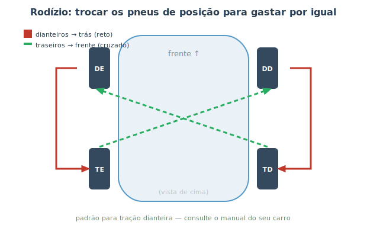

# Pneus: calibragem, rodízio e troca {#sec-pneus}

Os pneus são os **únicos** pontos de contato do carro com o chão. Toda a força do motor, toda a frenagem (@sec-freios-fund) e todo o esterçamento passam por quatro manchas de borracha, cada uma do tamanho aproximado da palma da sua mão. Pense nisso: a sua segurança literalmente se apoia nessas quatro áreas. Cuidar dos pneus é, por isso, uma das manutenções de maior retorno — e felizmente uma das mais simples de acompanhar em casa.

## Calibragem: o cuidado nº 1

Manter a **pressão correta** dos pneus é o cuidado mais importante e mais negligenciado. A pressão certa garante o contato ideal com o solo, a distância de frenagem prevista, o consumo de combustível adequado e o desgaste uniforme.

::: {.dica}
**Onde achar a pressão correta?** Não é no pneu — o número no flanco do pneu é a pressão *máxima*, não a recomendada. A pressão certa para o seu carro está numa **etiqueta na coluna da porta do motorista** (ou na tampa do tanque, ou no manual). Costuma haver dois valores: com o carro vazio e com carga/lotado.
:::

Calibre **com os pneus frios** (parados há algumas horas ou rodados menos de ~2 km), porque rodar esquenta o ar e eleva a pressão, dando uma leitura falsamente alta. E não esqueça do **estepe**: ele murcha parado e costuma ser lembrado só na emergência, quando já está vazio.

::: {.atencao}
**Pressão baixa é perigosa.** Um pneu murcho flexiona demais, **superaquece** e pode até estourar em alta velocidade, além de aumentar muito o consumo e a distância de frenagem. Pressão alta demais reduz o contato e deixa o carro "duro". Confira a calibragem a cada 15 dias e antes de viagens.
:::

## Ler o desgaste: o pneu conta o que está errado

O **desenho do desgaste** da banda de rodagem é um diagnóstico de graça: ele revela problemas de calibragem e de geometria, como mostra a @fig-desgaste-pneus.

{#fig-desgaste-pneus}

- **Uniforme:** parabéns, calibragem e alinhamento estão bons.
- **Centro gasto:** pressão **alta** demais — só o meio do pneu toca o chão.
- **Bordas gastas (os dois lados):** pressão **baixa** demais — o centro "afunda" e só as beiradas tocam.
- **Só um lado gasto:** problema de **alinhamento** (@sec-freios-fund). Vale também checar a suspensão.

Há ainda o **TWI** (indicador de desgaste): pequenas saliências no fundo dos sulcos. Quando a borracha gasta até nivelar com elas, o pneu chegou ao limite legal (1,6 mm de profundidade) e precisa ser trocado — pneu "careca" perde aderência, principalmente na chuva.

::: {.dica}
**O teste da moeda.** Sem instrumento à mão? Enfie uma moeda no sulco do pneu. Se a borda da moeda some bem dentro do sulco, ainda há borracha; se mal entra, o pneu está perigosamente gasto. É só uma estimativa — o indicador TWI é a referência oficial.
:::

## Rodízio: gastar por igual

Os pneus de um carro não se gastam na mesma velocidade: os dianteiros sofrem mais (esterçam e, na maioria dos carros, tracionam e freiam mais). Para que os quatro durem mais e por igual, faz-se o **rodízio** — trocá-los de posição periodicamente, como na @fig-rodizio-pneus.

{#fig-rodizio-pneus}

O padrão depende do tipo de tração e do pneu, e o manual do carro indica o certo. Um esquema comum para **tração dianteira** é: os dianteiros vão **direto para trás** e os traseiros vão **cruzados para a frente**. Aproveite o rodízio (em geral a cada 10.000 km) para conferir pressão, desgaste e a condição geral de cada pneu.

::: {.callout-note}
Alguns pneus são **direcionais** (têm um sentido de giro marcado por uma seta no flanco) ou **assimétricos**. Esses têm regras próprias de rodízio — às vezes só podem ir para a frente e para trás do **mesmo lado**. Repare na marcação antes de cruzar.
:::

## Troca do estepe com segurança

Furou? Troque o pneu com calma e segurança. Reveja o @sec-ferramentas e siga a ordem:

1. Pare em **local seguro e plano**, longe do tráfego, com pisca-alerta e triângulo. Freio de mão acionado e, se possível, calce a roda oposta.
2. **Antes de levantar o carro**, afrouxe (sem tirar) as porcas da roda furada — com o carro no chão, ele não gira ao fazer força.
3. Levante o carro com o macaco no ponto de apoio correto, **só o suficiente** para o pneu sair.
4. Remova as porcas, troque o pneu pelo estepe e recoloque as porcas **com a mão**.
5. Abaixe o carro e só então **aperte as porcas em cruz** (em forma de estrela, alternando lados opostos), para o aro assentar reto.

::: {.perigo}
Repetindo a regra de ouro do @sec-ferramentas: **nunca coloque mãos, pés ou qualquer parte do corpo embaixo do carro** durante a troca de pneu — você não precisa entrar embaixo para isso. Mantenha-se afastado do tráfego o tempo todo; trocar pneu no acostamento de rodovia é situação de risco real.
:::

::: {.atencao}
Muitos estepes são do tipo **"socorro"** (mais finos, geralmente o aro fica diferente). Eles têm **limite de velocidade** (em geral 80 km/h) e servem só para chegar a um borracheiro. Não rode com ele por muito tempo. Após apertar tudo, **confira a pressão** do estepe — ele costuma estar mais cheio de propósito.
:::

## Resumo

- Os pneus são o único contato do carro com o solo; cuidar deles é segurança pura.
- Calibre na pressão da etiqueta da porta (não a do flanco), com pneus frios, sem esquecer o estepe.
- O padrão de desgaste denuncia a causa: centro (pressão alta), bordas (pressão baixa), um lado (alinhamento).
- Use o indicador TWI para saber a hora de trocar; pneu careca perde aderência na chuva.
- Faça o rodízio periódico para os pneus durarem por igual, respeitando pneus direcionais/assimétricos.
- Na troca do estepe: afrouxe as porcas com o carro no chão, nunca fique embaixo, e aperte em cruz só depois de baixar.
