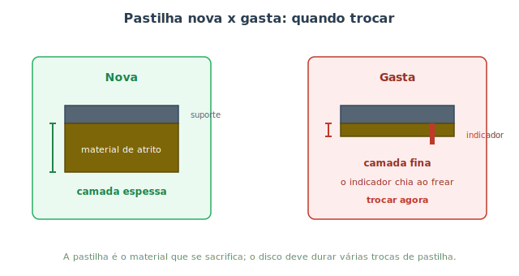

# Manutenção de freios {#sec-freios-manut}

No @sec-freios-fund você entendeu como o freio funciona: a pinça aperta as pastilhas contra o disco, e o atrito transforma movimento em calor. Aqui cuidamos de manter esse sistema confiável. Não há item no carro em que a manutenção preventiva importe mais — um motor que falha te deixa na mão; um freio que falha pode te machucar. Por isso este capítulo é, ao mesmo tempo, prático e cauteloso.

::: {.atencao}
Freio é item de segurança crítico. Você pode perfeitamente **inspecionar** e **monitorar** os freios em casa — e deveria. Mas a **troca de pastilhas** e, principalmente, a **sangria do fluido** exigem capricho e alguma prática. Se tiver qualquer dúvida no meio do caminho, pare e procure um profissional. Aqui, "mais ou menos" não serve.
:::

## Pastilhas: identificar o desgaste

As pastilhas são peças **de sacrifício**: o material de atrito vai se consumindo a cada frenagem, de propósito, para poupar o disco. Por isso elas têm vida limitada e precisam ser trocadas periodicamente. A @fig-pastilha-nova-gasta mostra a diferença.

{#fig-pastilha-nova-gasta}

Como saber que está na hora? Os sinais, do mais sutil ao mais grave:

- **Chiado agudo ao frear:** a maioria das pastilhas tem um **indicador de desgaste** — uma lingueta metálica que, quando a pastilha afina, começa a raspar no disco e produz um apito. É um aviso *projetado* para te mandar à oficina.
- **Inspeção visual:** dá para ver a espessura do material de atrito pela roda (às vezes sem nem desmontar). Camada muito fina = trocar.
- **Rangido metálico grave:** se passou do apito e agora é **metal contra metal**, a pastilha acabou e o suporte está riscando o disco. Aí o reparo fica bem mais caro.

::: {.perigo}
**Nunca ignore o chiado dos freios.** O apito é o sistema implorando por atenção *antes* de virar um problema sério. Rodar com pastilha no fim risca o disco (que custa muito mais que a pastilha) e, no limite, compromete a capacidade de frear. Ao primeiro chiado consistente, programe a troca.
:::

## Trocar as pastilhas (visão geral)

A troca de pastilhas é viável para quem já tem alguma prática e segue a segurança do @sec-ferramentas (carro **nos cavaletes**, roda removida). Em linhas gerais:

1. Com a roda fora, solte os parafusos da pinça e abra-a (sem desconectar a mangueira de freio; apoie a pinça para não pendurá-la pela mangueira).
2. Retire as pastilhas velhas, observando a posição de molas e clipes.
3. **Recue o pistão** da pinça com cuidado (uma ferramenta própria ou um grampo). Isso é necessário porque as pastilhas novas são mais grossas. Atenção: isso empurra fluido de volta ao reservatório.
4. Instale as pastilhas novas, remonte a pinça e aperte tudo no **torque** correto.
5. **Antes de sair**, com o motor ligado, **pise no freio várias vezes** até o pedal firmar — isso reposiciona o pistão contra as pastilhas novas.

::: {.perigo}
O passo 5 não é opcional. Depois de recuar o pistão e montar pastilhas novas, **o primeiro toque no pedal pode ir ao fundo sem frear**. Bombeie o pedal com o carro parado até ele endurecer, e teste os freios em baixa velocidade em local seguro **antes** de ir para o trânsito. Confira também o nível do fluido depois (ele sobe ao recuar o pistão).
:::

## O fluido de freio: sangria e troca

Lembre do @sec-freios-fund: a força do pedal chega às rodas por um fluido, e esse fluido **absorve umidade** com o tempo. Água no fluido baixa o ponto de fervura; numa frenagem forte ele pode ferver, formar bolhas de vapor (que comprimem) e o pedal "afunda". Por isso o fluido tem validade e deve ser **trocado periodicamente**, em geral a cada **2 anos**, mesmo parecendo bom.

A **sangria** é o processo de expulsar o ar (e o fluido velho) do sistema pelos parafusos sangradores em cada roda. Ar no sistema é justamente o que causa o pedal mole "que firma bombeando" que vimos no fluxograma do @sec-diagnostico.

::: {.atencao}
A sangria é uma tarefa que pede **dois cuidados absolutos**: nunca deixar o reservatório esvaziar (entra mais ar) e seguir a **ordem correta** das rodas (definida pelo fabricante). Feita errada, ela introduz ar em vez de tirar — e piora o freio. Para iniciantes, a troca de fluido com sangria é uma das tarefas que **mais vale a pena delegar** a um profissional, ou fazer sob orientação de alguém experiente.
:::

::: {.dica}
**Cuidados com o fluido de freio:**

- Use o **tipo especificado** (DOT 3, DOT 4, etc. — escrito na tampa do reservatório). Não misture tipos sem saber se são compatíveis.
- O fluido é **higroscópico** (puxa umidade do ar), então não deixe a embalagem aberta e descarte sobras antigas.
- Ele **danifica a pintura**: limpe imediatamente qualquer respingo na lataria.
:::

## O que dá para fazer em casa e o que delegar

- **Faça em casa, com tranquilidade:** monitorar o chiado, inspecionar visualmente a espessura das pastilhas, conferir o **nível do fluido** no reservatório (entre mín e máx) e observar a cor do fluido (muito escuro sugere troca).
- **Delegue ou faça com apoio experiente:** a troca de pastilhas, se você nunca fez, e principalmente a **sangria/troca de fluido**.

::: {.callout-note}
Um detalhe útil: o nível do fluido de freio **baixa naturalmente** conforme as pastilhas se desgastam (o pistão avança e ocupa mais espaço). Um nível um pouco abaixo do máximo, com pastilhas já rodadas, pode ser normal. Mas uma **queda rápida** de nível indica vazamento — e aí é urgente (reveja a cor âmbar no @sec-ouvindo).
:::

## Resumo

- Freio é a manutenção preventiva mais crítica: inspecione sempre, mas trate trocas com capricho.
- Pastilhas são peças de sacrifício; o chiado do indicador de desgaste é o aviso para trocar antes de virar metal contra metal.
- Na troca de pastilhas, recue o pistão e, ao final, bombeie o pedal até firmar antes de dirigir.
- O fluido de freio absorve umidade e deve ser trocado a cada ~2 anos; ar no sistema causa pedal mole.
- A sangria exige ordem correta e nível sempre cheio; é a tarefa que mais vale delegar se você é iniciante.
- Em casa: monitore chiado, espessura das pastilhas, nível e cor do fluido; queda rápida de nível é sinal de vazamento.
