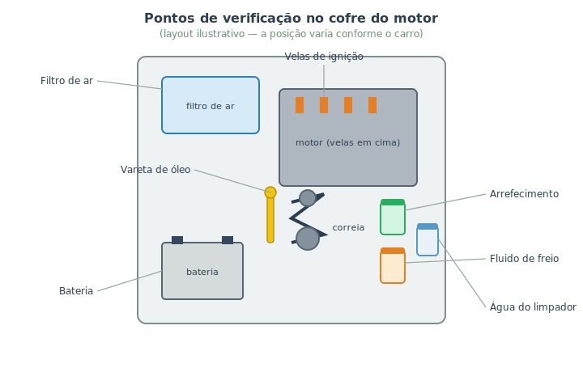

# Fluidos, correias e velas {#sec-fluidos}

Boa parte da manutenção preventiva não exige levantar o carro nem desmontar nada: basta **abrir o capô e olhar**. Conferir níveis de fluidos, observar correias e ficar de olho em itens como velas e bateria são tarefas rápidas que previnem panes caras e perigosas. Este capítulo é o seu roteiro de inspeção do cofre do motor — o tipo de checagem que vale fazer uma vez por mês e antes de toda viagem.

::: {.perigo}
Faça todas estas verificações com o **motor frio e desligado**, em piso plano. No cofre há peças quentes, partes girando (correia, ventoinha — que pode ligar sozinha mesmo com o motor desligado) e o sistema de arrefecimento pressurizado. Reveja a segurança do @sec-ferramentas.
:::

## O mapa do cofre

Cada carro organiza o cofre à sua maneira, mas os pontos a verificar são quase sempre os mesmos. A @fig-pontos-cofre mostra um layout ilustrativo com os principais.

{#fig-pontos-cofre}

::: {.dica}
**As tampas são coloridas de propósito.** Os reservatórios costumam ter tampas em cores diferentes justamente para você não confundir os fluidos. Muitas trazem também o **símbolo** do sistema. Na dúvida sobre onde fica cada coisa no *seu* carro, o manual do proprietário tem o mapa exato do cofre. Aprenda a localizar cada ponto uma vez, com calma, e as próximas conferências serão rápidas.
:::

## Os fluidos: o que conferir e como

A maioria dos reservatórios é translúcida e tem marcas de **mínimo (MÍN)** e **máximo (MÁX)** na lateral — basta olhar o nível por fora, sem abrir. Confira:

- **Óleo do motor:** pela **vareta**, com o motor desligado e frio, no plano (o passo a passo de leitura está no @sec-troca-oleo). É o mais importante de todos.
- **Líquido de arrefecimento:** pelo **reservatório de expansão**, **só com o motor frio** (@sec-arrefecimento). Nunca abra quente.
- **Fluido de freio:** nível entre mín e máx; lembre que ele baixa um pouco conforme as pastilhas gastam, mas queda rápida indica vazamento (@sec-freios-manut).
- **Água do limpador (esguicho):** o mais inofensivo — é só água (de preferência com aditivo próprio). Complete sempre; ficar sem na hora errada atrapalha a visibilidade.
- **Direção hidráulica** (se o carro tiver): também tem reservatório próprio com nível.

::: {.atencao}
**Completar é diferente de resolver.** Se um reservatório vive baixando, há um **vazamento** ou um consumo anormal — e completar só adia o problema. Investigue a origem (reveja as cores de vazamento no @sec-ouvindo). E **nunca troque um fluido pelo outro**: cada um tem composição e função específicas. Confira a tampa antes de completar.
:::

## Correias: inspeção visual

A **correia** (a serpentina/acessórios) transmite o giro do motor para o alternador, a bomba d'água, o compressor do ar-condicionado e a direção hidráulica. Se ela arrebenta, vários sistemas param de uma vez — incluindo a recarga da bateria (@sec-eletrico) e, em muitos carros, a bomba d'água (superaquecimento, @sec-arrefecimento).

A inspeção é visual e simples (motor desligado): procure **rachaduras**, **fiapos/desfiamento**, brilho excessivo (vidrado) ou pedaços faltando. Uma correia frouxa costuma **assobiar** ao ligar o carro ou ao acelerar (lembra do @sec-ouvindo?).

::: {.atencao}
Atenção a um ponto sério: a **correia dentada** (ou "de distribuição"), presente em parte dos motores, sincroniza válvulas e pistões. Ela fica **escondida** atrás de uma tampa e tem prazo de troca rígido em quilômetros/tempo. Se ela rompe em motores chamados "de interferência", **válvulas e pistões se chocam** e o motor quebra gravemente. A troca da correia dentada é serviço de oficina, mas **conhecer e respeitar o prazo de troca dela é responsabilidade sua** — está no manual e no @sec-cronograma. Nem todo motor usa correia dentada (alguns usam corrente, que dura mais), mas descubra qual é o do seu.
:::

## Velas de ignição

As **velas** produzem a faísca que inflama a mistura (@sec-motor e @sec-eletrico). Com o tempo, seus eletrodos se desgastam e elas acumulam depósitos, o que enfraquece a faísca e causa **falhas de combustão**: motor tremendo, perda de força, consumo maior e, às vezes, a luz de injeção (códigos da família P030X, @sec-obd2).

Trocar velas é uma tarefa de dificuldade média, possível em casa em muitos carros (em outros, o acesso é complicado). Use sempre o **tipo e a folga** especificados e aperte no **torque** correto — vela muito apertada danifica a rosca do cabeçote.

::: {.dica}
A própria vela é um pequeno "diagnóstico" quando removida: a cor da ponta conta como anda a queima. Tom **marrom-claro/acinzentado** é o ideal. **Preto e seco (fuliginoso)** sugere mistura rica demais; **preto e oleoso** indica óleo na câmara; **branco/derretido** aponta superaquecimento. Não decore — apenas saiba que vale observar.
:::

<!-- TODO foto: comparação de velas de ignição (nova, com depósito de carbono, e oleosa) para ilustrar a "leitura" da ponta da vela — buscar em Wikimedia Commons, licença CC -->

## A bateria

Reforçando o @sec-eletrico: confira os **terminais** (sem o pó branco/esverdeado da sulfatação, bem apertados) e observe a idade (a maioria dura de 2 a 4 anos). Algumas baterias têm um visor indicador de carga. Em carros parados por longos períodos, a bateria descarrega — dar uma volta periódica ajuda.

## Resumo

- Muita manutenção preventiva é só abrir o capô e olhar; faça com o motor frio e desligado.
- Confira os níveis pela lateral dos reservatórios (mín/máx); as tampas são coloridas para você não confundir os fluidos.
- Completar não resolve vazamento: se um nível baixa sempre, investigue a causa.
- Inspecione a correia de acessórios em busca de rachaduras e desfiamento; respeite o prazo da correia dentada, cuja ruptura pode destruir o motor.
- Velas desgastadas causam falhas de combustão; troque com o tipo, a folga e o torque corretos.
- Cuide dos terminais e da idade da bateria.
