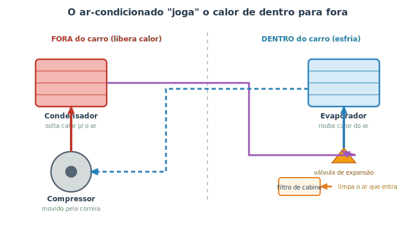

# Ar-condicionado e filtro de cabine {#sec-ar-condicionado}

O ar-condicionado é, para muita gente, item de primeira necessidade — e também um grande mistério: "ele cria ar frio?". Não cria. Entender o que ele realmente faz desfaz vários mitos e ajuda a cuidar bem do sistema. Este é um capítulo de manutenção prática, mas começa com um pouco de "porquê", como todos os outros.

A ideia central é surpreendente: **o ar-condicionado não fabrica frio, ele remove calor.** Ele pega o calor de dentro do carro e o joga para fora, exatamente como uma geladeira faz com o calor de dentro dela (que sai pela grade quente atrás). Não existe "máquina de frio" — existe máquina de **transportar calor**.

## Como ele funciona

Para transportar calor, o sistema usa um **gás refrigerante** que circula num anel fechado, mudando de estado (líquido ↔ gás) e, com isso, absorvendo calor de um lado e soltando do outro. Acompanhe na @fig-circuito-ar-condicionado.

{#fig-circuito-ar-condicionado}

- **Compressor:** o coração do sistema, movido pela **correia** do motor (@sec-fluidos). Ele comprime o gás e o faz circular. É por isso que o ar-condicionado **aumenta um pouco o consumo** — ele "rouba" força do motor.
- **Condensador:** fica na frente do carro, junto ao radiador. Aqui o gás quente e comprimido **libera calor** para o ar de fora e vira líquido.
- **Válvula de expansão:** o líquido passa por um estreitamento e se expande, ficando subitamente **muito frio**.
- **Evaporador:** escondido atrás do painel. O ar da cabine passa por ele, **entrega seu calor** ao gás frio e volta geladinho para dentro. O gás, aquecido, retorna ao compressor e o ciclo recomeça.

::: {.dica}
**Por que pinga água embaixo do carro com o ar ligado?** Lembra da poça transparente do @sec-ouvindo? É o evaporador "suando": ao esfriar o ar, ele também condensa a umidade dele, como um copo gelado num dia quente. Essa água escorre por um dreno para fora — e é **totalmente normal**. Estranho seria não pingar.
:::

## O filtro de cabine: o pulmão do habitáculo

Há um filtro que muita gente nem sabe que existe: o **filtro de cabine** (ou filtro de ar-condicionado / antipólen). Ele limpa **todo o ar que entra no habitáculo**, retendo poeira, pólen e fuligem — protegendo tanto você quanto o evaporador.

Quando ele entope, o ar custa a entrar, o ar-condicionado "perde força" e surge aquele **cheiro de mofo**. A boa notícia: trocá-lo costuma ser uma das tarefas **mais fáceis** que existem, muitas vezes sem ferramenta, atrás do porta-luvas.

::: {.dica}
**Cheiro de mofo ao ligar o ar?** Quase sempre é o filtro de cabine saturado e/ou fungos no evaporador (que vive úmido). Trocar o filtro resolve boa parte. Um hábito que ajuda: **desligar o compressor (botão A/C) alguns minutos antes** de chegar, deixando só a ventilação — isso seca o evaporador e reduz o mofo.
:::

## Cuidados e manutenção

- **Use o ar-condicionado regularmente**, inclusive no inverno, nem que seja por alguns minutos. Parado por muito tempo, as vedações ressecam e o gás pode vazar. É como uma articulação: parada demais, enferruja.
- **Troque o filtro de cabine** no intervalo do manual (em geral a cada 10.000–15.000 km ou 1 ano; antes, se você anda em muita poeira).
- **O ar gelando menos** com o tempo geralmente indica **gás baixo** (por um vazamento lento) ou sujeira no condensador. A recarga de gás e a busca por vazamentos são serviço de oficina especializada.
- **Limpe o condensador**: por ficar na frente do carro, ele acumula folhas e insetos que atrapalham a troca de calor.

::: {.atencao}
A recarga e o reparo do circuito de gás **não são tarefa caseira**. O gás refrigerante está sob **alta pressão**, pode causar queimaduras por congelamento na pele e nos olhos, e é controlado por questões ambientais — deve ser manuseado com equipamento próprio e recolhido corretamente, nunca liberado na atmosfera. Se o ar parou de gelar, leve a um especialista. Em casa, você cuida do **filtro de cabine** e da limpeza do condensador.
:::

::: {.callout-note}
**Ar-condicionado x desembaçador.** Em dia frio e úmido, o vidro embaça por dentro. Ligar o **A/C** ajuda a desembaçar rapidamente, porque o sistema **resseca o ar** ao esfriá-lo — por isso muitos carros acionam o compressor sozinhos na função de desembaçar, mesmo com o ar quente selecionado. Não é contraditório: ele primeiro remove a umidade, depois reaquece.
:::

## Resumo

- O ar-condicionado não cria frio: ele **transporta calor** de dentro do carro para fora, como uma geladeira.
- O gás refrigerante circula entre o evaporador (dentro, esfria) e o condensador (na frente, libera calor), movido pelo compressor — que aumenta um pouco o consumo.
- A água que pinga embaixo do carro com o ar ligado é só condensação: normal.
- O filtro de cabine limpa o ar que entra; entupido, causa perda de força e cheiro de mofo — e é fácil de trocar em casa.
- Use o ar regularmente, troque o filtro de cabine no prazo e mantenha o condensador limpo.
- Recarga de gás e reparos do circuito são serviço de especialista; em casa, cuide do filtro e da limpeza externa.
