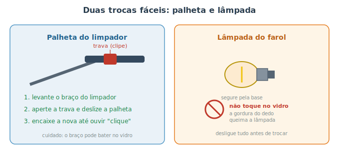

# Pequenas trocas que você mesmo faz {#sec-trocas-rapidas}

Nem toda manutenção exige levantar o carro ou sujar as mãos de graxa. Existem trocas **rápidas, baratas e seguras** que qualquer pessoa consegue fazer em poucos minutos, sem ferramentas especiais — e que melhoram diretamente sua **segurança e visibilidade**. Este capítulo reúne as principais. São pequenas vitórias que dão confiança para o iniciante e poupam idas desnecessárias à oficina.

A @fig-trocas-rapidas mostra as duas mais comuns: a palheta do limpador e a lâmpada do farol.

{#fig-trocas-rapidas}

## Palhetas do limpador

A palheta é a tira de borracha que limpa o para-brisa. Com o tempo e o sol, a borracha **resseca, racha e endurece**, deixando riscos e falhas — perigoso justamente quando você mais precisa enxergar, na chuva. Trocar é simples:

1. **Levante o braço** do limpador, afastando-o do vidro.
2. Localize a **trava (clipe)** que prende a palheta ao braço; aperte-a e **deslize** a palheta para soltar.
3. Encaixe a palheta nova até ouvir o **"clique"** e abaixe o braço com cuidado.

::: {.atencao}
Ao levantar o braço, **não o solte** sem a palheta encaixada: a mola é forte e ele pode **bater no vidro** e trincá-lo. Se precisar largar, apoie um pano sobre o vidro. E confira a **medida certa** da palheta para o seu carro — muitas vezes a do motorista e a do passageiro têm tamanhos diferentes.
:::

::: {.dica}
Sinais de palheta no fim: barulho de "chiado", trechos que não limpam, riscos em arco no vidro. Antes de trocar, vale **limpar a borracha** com um pano úmido — às vezes é só sujeira acumulada. Não esqueça também de **completar o reservatório do esguicho** (@sec-fluidos): limpador sem água, na hora errada, é meio caminho para um acidente.
:::

## Lâmpadas (faróis e lanternas)

Uma luz queimada é, além de risco, motivo de multa. Trocar a lâmpada costuma ser tarefa de poucos minutos, com acesso por trás do farol (no cofre) ou da lanterna. O procedimento varia entre tipos de lâmpada (rosca, baioneta, encaixe), mas a lógica é a mesma: desconectar, remover a velha, encaixar a nova.

::: {.perigo}
Antes de mexer, **desligue os faróis e, idealmente, a chave**. Faróis acesos esquentam muito a lâmpada (risco de queimadura) e lidar com fiação energizada pode causar curto.
:::

::: {.atencao}
**Nunca toque no vidro** de uma lâmpada halógena nova com os dedos. A **gordura da pele** cria um ponto quente que faz a lâmpada queimar precocemente. Segure-a sempre pela **base** metálica/plástica; se tocar no vidro sem querer, limpe com álcool antes de instalar. Use sempre uma lâmpada da **mesma especificação** (o tipo vem no manual ou na própria lâmpada antiga).
:::

::: {.dica}
**Confira todas as luzes de vez em quando** (no checklist mensal do @sec-cronograma): faróis baixo e alto, lanternas, luz de freio, setas, ré e placa. As de freio e seta você pode testar sozinho aproveitando um reflexo numa parede ou vitrine, ou pedindo ajuda a alguém. Muitas vezes a "lâmpada queimada" é, na verdade, um **fusível** (@sec-eletrico) — confira o fusível correspondente se a troca da lâmpada não resolver.
:::

## Outras trocas simples ao seu alcance

Além dessas duas, com o que você aprendeu no manual já dá para cuidar de vários itens simples:

- **Filtro de cabine** (@sec-ar-condicionado): em muitos carros, sai e entra atrás do porta-luvas, sem ferramenta.
- **Filtro de ar do motor** (@sec-combustivel): costuma ficar numa caixa de plástico com presilhas, fácil de abrir.
- **Completar fluidos** (esguicho, e conferir os demais níveis): @sec-fluidos.
- **Palhetas do vidro traseiro e dos faróis** (quando houver), pela mesma lógica da dianteira.

::: {.callout-tip}
## Comece pelas fáceis
Estas trocas são o melhor ponto de partida para quem está ganhando confiança: risco baixo, resultado imediato e nenhuma necessidade de levantar o carro. Conforme se sentir à vontade, avance para as tarefas dos capítulos anteriores — sempre respeitando a segurança do @sec-ferramentas.
:::

## Resumo

- Há trocas rápidas, baratas e seguras que dispensam ferramentas e melhoram diretamente sua visibilidade e segurança.
- Palhetas ressecadas riscam o vidro: troque ao primeiro sinal e nunca solte o braço do limpador sem a palheta.
- Ao trocar lâmpadas, desligue tudo antes e **nunca toque no vidro** de uma halógena — segure pela base.
- Use sempre peças na medida/especificação corretas; luz "queimada" às vezes é só fusível.
- Filtro de cabine, filtro de ar e completar fluidos também estão ao seu alcance.
- São o melhor ponto de partida para ganhar confiança antes das tarefas mais avançadas.
