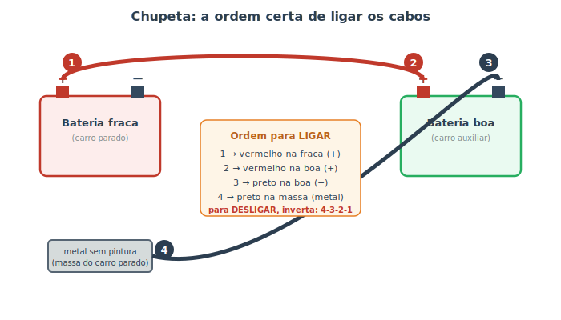

# Emergências na estrada {#sec-emergencias}

Mesmo com toda a manutenção em dia, imprevistos acontecem: a bateria que arria num dia frio, o pneu que fura, o carro que esquenta no congestionamento. Saber agir nesses momentos — com **segurança em primeiro lugar** — faz a diferença entre um susto resolvido em minutos e uma situação perigosa. Este capítulo reúne os procedimentos de emergência mais úteis e o que vale a pena ter sempre no carro.

::: {.perigo}
**Regra zero de qualquer emergência: tire-se do perigo antes de cuidar do carro.** Pare o mais longe possível do tráfego (acostamento largo, área de escape), ligue o **pisca-alerta**, coloque o **triângulo** a uma boa distância e, em rodovia movimentada, considere sair do veículo pelo lado oposto ao tráfego e aguardar atrás da defensa. Carro é reparável; você não.
:::

## Bateria descarregada: a chupeta

A pane mais comum. Se ao girar a chave você ouve só um **clique** (ou nada) e as luzes estão fracas, provavelmente é a bateria (reveja o @sec-diagnostico). A solução de emergência é a **chupeta**: usar a bateria de outro carro para dar a partida. A **ordem de ligar os cabos importa** — e muito, por segurança. Siga a @fig-chupeta-bateria.

{#fig-chupeta-bateria}

1. Aproxime os carros **sem que se toquem**, ambos desligados.
2. **Vermelho (+)** no polo positivo da **bateria fraca**.
3. **Vermelho (+)** no positivo da **bateria boa**.
4. **Preto (−)** no negativo da **bateria boa**.
5. A outra ponta do **preto (−)** num ponto de **metal sem pintura** do carro parado (um parafuso do motor, por exemplo), **longe da bateria**.
6. Ligue o carro **auxiliar** e deixe-o funcionando 1–2 minutos. Depois tente dar a partida no carro parado.
7. Pegou? **Remova os cabos na ordem inversa** (4 → 3 → 2 → 1) e mantenha o carro recuperado funcionando/rodando um tempo para o alternador recarregar a bateria (@sec-eletrico).

::: {.perigo}
Por que o cabo preto vai num **metal** e não no polo negativo da bateria fraca? Porque uma bateria descarregada pode liberar **gases inflamáveis**, e a última conexão sempre solta uma pequena **faísca**. Fazendo essa faísca longe da bateria, evita-se o risco de explosão. Outras regras: **nunca encoste as garras vermelha e preta** uma na outra nem em metal quando os cabos estão ligados (curto), e confira se as duas baterias são de **mesma tensão** (12 V).
:::

::: {.atencao}
Se a bateria arriou **sozinha sem motivo** (carro novo, luzes não ficaram acesas), desconfie do **alternador** (@sec-eletrico): ele pode não estar recarregando, e a bateria vai arriar de novo em pouco tempo. Se a bateria está **velha** (mais de 3–4 anos) ou **inchada/vazando**, troque-a — chupeta é solução de emergência, não conserto.
:::

## Superaquecimento na estrada

Se o ponteiro de temperatura sobe para o vermelho ou a luz acende, aja como no fluxograma do @sec-diagnostico:

1. **Desligue o ar-condicionado** e ligue a **ventilação interna no quente** no máximo — por estranho que pareça, isso puxa calor do motor para dentro do carro e ajuda a aliviar.
2. **Pare em local seguro e desligue o motor.** Não tente "chegar logo": é assim que se quebra o motor.
3. **Espere esfriar** (30 minutos ou mais). **Nunca abra o radiador quente** (@sec-arrefecimento) — jato de vapor fervente.
4. Com o motor frio, verifique o **nível** do líquido e procure vazamentos. Complete se possível (na falta de aditivo, água serve para a emergência) e siga devagar, de olho no ponteiro, até uma oficina.

## Pneu furado

O passo a passo seguro da troca do estepe está no @sec-pneus (afrouxar as porcas com o carro no chão, nunca ficar embaixo do carro, apertar em cruz só depois de baixar). Em rodovia, priorize parar bem longe do tráfego; se não for seguro trocar ali, chame socorro. Lembre que o estepe "socorro" tem **limite de velocidade** e é só para chegar ao borracheiro.

## O kit de emergência

Vale a pena manter no carro, além dos itens obrigatórios:

- **Triângulo, macaco, chave de roda e estepe calibrado** (os obrigatórios — confira periodicamente).
- **Cabos de chupeta** de bitola adequada.
- **Lanterna** (de preferência com pilhas guardadas à parte) e um **colete refletivo**.
- **Luvas**, um pano e um pouco de **água** (para o radiador e para você).
- **Calços** para as rodas e um carregador portátil de bateria (jump starter), se possível.
- Documentos do carro e o **telefone do seguro/guincho** anotado.

::: {.dica}
**Saber a hora de chamar o guincho também é sabedoria.** Vazamento de combustível, freio que falhou, fumaça densa, motor que superaqueceu de novo, ou qualquer situação em rodovia movimentada onde mexer no carro te exponha ao tráfego: não arrisque. Acione o guincho/seguro. Os procedimentos deste capítulo são para o que dá para resolver **com segurança** à beira da estrada.
:::

## Resumo

- Em qualquer emergência, primeiro se proteja: saia do tráfego, pisca-alerta, triângulo e, se preciso, aguarde fora do carro em local seguro.
- Chupeta: ligue na ordem 1-2-3-4 (vermelho na fraca, vermelho na boa, preto na boa, preto no metal do carro parado) e desligue na ordem inversa.
- O cabo preto vai num metal, longe da bateria, para a faísca não inflamar os gases.
- Superaqueceu: ligue a ventilação quente, pare, desligue, espere esfriar e nunca abra o radiador quente.
- Pneu furado: siga a troca segura do estepe (@sec-pneus); em rodovia, priorize sua segurança.
- Mantenha um kit de emergência e saiba quando é hora de chamar o guincho em vez de insistir.
