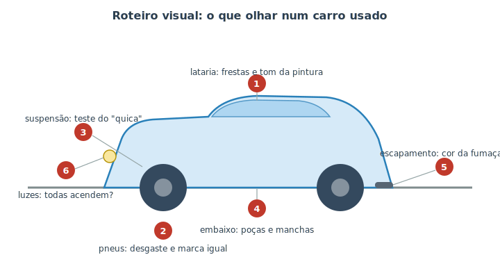

# Avaliando um carro usado {#sec-inspecao-usado}

Este é o capítulo que **junta tudo**. Comprar um carro usado é, no fundo, um grande exercício de diagnóstico — exatamente o que você treinou na Parte II. Aqui você vai usar os sentidos (@sec-ouvindo), o conhecimento dos sistemas (Parte I) e até o leitor de códigos (@sec-obd2) para responder a uma pergunta de muito valor: **vale a pena comprar este carro pelo preço pedido?**

Não é preciso ser mecânico. Com um roteiro e atenção, qualquer pessoa identifica os sinais de alerta mais comuns e evita as piores armadilhas. E há uma regra de ouro que vale antes de tudo:

::: {.dica}
**A melhor inspeção caseira não dispensa a profissional.** Se o carro passar no seu roteiro e você estiver inclinado a comprar, leve-o a um mecânico de sua confiança ou a uma **vistoria cautelar** antes de fechar negócio. Custa pouco perto do valor do carro e pode revelar o que o olho leigo não vê (chassi, números, sinistro). O seu roteiro serve para **eliminar rapidamente** os carros ruins e chegar à vistoria só com um bom candidato.
:::

## Antes de ver o carro: os documentos

Boa parte das armadilhas se evita no papel, sem nem ligar o motor:

- **Confira a procedência:** débitos (IPVA, multas), restrições/financiamento em aberto e histórico de **sinistro/leilão**. Há consultas online pela placa e o chamado *laudo cautelar*.
- **Bata os números:** o número do chassi e do motor devem **coincidir** com o documento. Divergência é sinal de alerta sério.
- **Revisões:** peça o histórico/notas de manutenção. Um carro com revisões em dia (especialmente a **correia dentada**, @sec-fluidos) vale mais e dá menos dor de cabeça.

## A inspeção visual (carro frio e parado)

Chegue **antes** do combinado, se puder: é importante ver o carro com o **motor frio**. Vendedor que já deixa o motor quente pode estar escondendo uma partida difícil ou fumaça. Use o roteiro da @fig-inspecao-usado.

{#fig-inspecao-usado}

1. **Lataria, frestas e pintura.** Olhe o carro de longe e de lado: as **frestas** entre portas, capô e paralamas devem ser **uniformes**. Frestas tortas e diferenças de **tom/textura** na pintura denunciam batida e repintura. Passe a mão; procure ondulações e excesso de tinta nas bordas.
2. **Pneus.** Os quatro devem ser de marca/medida compatíveis e com desgaste **uniforme** — desgaste irregular aponta alinhamento/suspensão (@sec-pneus). Pneus carecas também são custo imediato.
3. **Suspensão (teste do "quica").** Empurre forte cada canto do carro para baixo e solte: ele deve voltar e **parar** (no máximo um leve retorno). Se fica balançando, os amortecedores estão gastos (@sec-freios-fund).
4. **Por baixo.** Olhe o chão sob o carro (o truque do papelão do @sec-ouvindo, se possível) e por baixo: **poças e manchas** de óleo, arrefecimento ou fluido são bandeiras vermelhas.
5. **Escapamento.** Veja a cor da fumaça na partida e acelerando (próximo item). Fuligem preta oleosa na ponta do escapamento sugere queima de óleo.
6. **Luzes e elétrica.** Teste **todas**: faróis, lanternas, freio, setas, ré, interna, painel. Veja se alguma luz de advertência fica **acesa** após a partida (@sec-luzes).

::: {.atencao}
Desconfie de **carro "bom demais"** pelo preço, vendedor com pressa, recusa em deixar você levar a um mecânico, ou que já chega com o motor quente. Esses são, isoladamente, sinais de alerta — juntos, motivo para desistir.
:::

## Ligando o motor e dirigindo

Com o motor ainda frio:

- **Partida:** deve ser rápida e firme. Demora, vários "tic-tic" ou estalos pedem atenção (@sec-diagnostico).
- **Fumaça na partida:** branca densa e adocicada (arrefecimento), azul (óleo) ou preta (combustível) são problemas; vapor branco fino que some é normal (@sec-motor).
- **Marcha lenta:** o motor deve ficar **estável**, sem tremer nem oscilar a rotação.
- **Ruídos e cheiros:** ouça e cheire conforme o @sec-ouvindo — tique-taque, assobio de correia, cheiro de queimado.

No **test drive** (com a permissão do dono e atenção redobrada à segurança):

- **Freios:** devem parar firme e reto, sem puxar para um lado, sem trepidar e sem pedal mole (@sec-freios-fund).
- **Direção:** o carro deve seguir reto sem você corrigir; o volante não deve vibrar nem ter folga excessiva.
- **Câmbio:** trocas suaves no manual (embreagem que não "patina") ou no automático (sem trancos nem demora). Reveja o @sec-transmissao.
- **Temperatura:** o ponteiro deve subir e **estabilizar** na faixa normal, sem superaquecer.

::: {.dica}
**Leve um leitor OBD-II** (@sec-obd2). Conecte e veja se há códigos guardados — e desconfie se os "monitores" aparecerem **não prontos**, o que sugere que os códigos foram **apagados há pouco** (talvez para esconder a luz de injeção antes da venda). É uma checagem de poucos minutos que diz muito.
:::

## Juntando tudo: decidir

Nem todo defeito é motivo para desistir — alguns são **moeda de troca** para negociar o preço (pneus no fim, palhetas, uma revisão próxima). Outros são **sinais de fuga**: indício de batida estrutural, superaquecimento, fumaça azul, números que não batem, pendências de documento. Some o custo provável dos reparos ao preço e compare com um carro semelhante em melhor estado. E, valendo a pena, **feche só após a vistoria profissional**.

::: {.callout-tip}
## Você já sabe o suficiente
Repare como, neste capítulo, você aplicou quase tudo do manual: sistemas, sentidos, luzes, OBD-II, pneus, freios, suspensão. Esse é o objetivo final do livro — transformar você num dono **atento e informado**, capaz de cuidar do carro que tem e de escolher bem o próximo.
:::

## Resumo

- Comprar usado é um exercício de diagnóstico: use os sentidos, o conhecimento dos sistemas e o OBD-II.
- Comece pelos documentos: procedência, sinistro/leilão, números de chassi/motor batendo e histórico de revisões.
- Veja o carro frio e parado: frestas e pintura (batida), pneus, teste do "quica", vazamentos por baixo, fumaça e luzes.
- Na partida e no test drive, avalie estabilidade, ruídos, freios, direção, câmbio e temperatura.
- Leve um leitor OBD-II e desconfie de códigos recém-apagados.
- Defeitos pequenos negociam preço; sinais estruturais ou de motor são motivo para desistir — e confirme com vistoria profissional antes de fechar.
